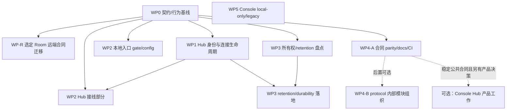

# 渐进重构计划

> **状态：计划草案，未执行。** 本文只描述未来可执行的工作包、依赖和验收，不表示任何代码、协议或产品决策已经批准或落地。
>
> **调查基线：** 2026-09-16。事实引用来自源码定位和本次只读调查；本任务没有运行 build、test、lint、formatter、部署或跨进程 smoke。
>
> **阅读前提：** 先读 [现状架构](current-state.md)、[问题诊断](diagnosis.md)、[目标架构](target-architecture.md) 和 [工程规则](engineering-rules.md)。本计划不取代接口、配置、运维或开发手册。

## 1. 目标、边界与状态标记

目标是在保留当前五个 Rust crate 和既有部署拓扑的前提下，先把每个 crate 内的边界收紧，再以小而可回退的提交迁移调用方。五个 crate 是 `agentic-gpt`、`agentic-gpt-hub`、`agentic-gpt-protocol`、`agentic-apply-patch`、`agentic-browser-host`；不因架构整理新造 service、crate 或通用框架。

目标系统仍是 **Agent 的受控执行基础设施**：

- Agent 拥有本地 policy/confirmation、process/jobs/terminal、files、network/downstream MCP、browser lease、skills 和 Room 文件资源；`local_service` 及其后的执行模块是实际效果的 owner。
- Hub 仅拥有入口、action/OAuth 认证、Agent registry、连接/代际、dispatch、confirmation coordination、run receipt、历史与有限 projection；它不执行 Agent 主机上的 shell、tmux、MCP、Browser 或 Room 文件写入。
- `agentic-gpt-protocol` 只拥有 wire DTO、枚举、envelope 身份和必要的纯契约规则；不吸收 I/O、数据库、执行器或业务服务。
- `agentic-apply-patch` 保持纯独立算法；文件策略、路径锁、revision、确认和提交继续在 Agent 的 `file_ops`。
- `agentic-browser-host` 是独立的浏览器扩展 bridge 进程，不伪装成 Agent 的 Browser SDK、lease 或核心执行器。
- stdio、HTTP、local Unix socket、Hub WS/SSE/MCP 是入口适配器，共享应用操作，不互相调用对方的 transport DTO；TUI/Console 是交互适配器。
- Android attention 是现有 local-only 功能，权威数据在 Android 本地 Room，OS alarm/notification 只是副作用；不自动发展 Hub reminder/task scheduler。
- Room 保留受控文件、文档与维护能力，但不是长期推理记忆、上下文管理或通用 memory subsystem。
- 公开 legacy parity 必须在真实 consumer 证据下沿用已有兼容边界、完成全部 caller 的 clean cutover 或明确退场，不能顺手留下无限期兼容 shim。

### 状态标记

- **[事实]**：调查以相对路径、符号和当前实现为依据。
- **[推断]**：由事实推导的结构风险或维护成本，不等于已复现故障或已确认漏洞。
- **[未验证]**：本次只读调查未运行的场景、外部组件或部署行为。
- **[用户决策]**：改变公开行为、权限、兼容性、数据保留或产品范围前，必须由维护者/产品负责人选择。
- **[技术决定]**：在不改变上述合同的情况下，维护者可自行选择的实现细节。
## 1.1 与正式诊断编号的对应

本计划统一使用 `diagnosis.md` 的正式编号 **A01–A09**；调查报告中的严重度/P 编号仅是原材料索引，不作为本路线图的风险编号。A 编号表示需要核验或处理的主题，不表示每项都是已证实漏洞。

| 正式诊断 | 主题（以 `diagnosis.md` 为准） | 主要工作包 | 计划中的处理边界 |
|---|---|---|---|
| A01 | 多份公共合同缺少语义一致性门槛 | WP0、WP4-A | 先冻结差异，再用真实 decode/dispatch/response 选择 adapter 或 spec cutover |
| A02 | Room 接口 cutover 未跨端完成 | WP0、WP-R | WP0 只记录断裂；WP-R 仅迁移被选定的远端能力，不强制映射全部 current 工具 |
| A03 | tool visibility、capability、authorization 分散 | WP2 | 最小 crate 内 operation gate；不造大 capability registry，不默认改权限 |
| A04 | Hub 连接、run、waiter 所有权未形成同一不变量 | WP1 | 绑定 connection/run/request/hash owner；区分可靠迟到结果与当前连接状态 |
| A05 | 配置可变性与启动派生资源不一致 | WP2、WP3 | 分层 startup-only/live-safe/restart-required，避免 config 与派生资源分裂 |
| A06 | “受控”被不同机制赋予不同保证 | WP2、WP3 | 先 threat model 与兼容决策；诚实标记 policy/sandbox/external trust，不擅自改默认 |
| A07 | 持久化、等待和投影缺少一致语义说明 | WP1、WP3 | 定义 durability、retention、freshness 和恢复状态，不把 best-effort 当 durable |
| A08 | Console 原型/本地能力与远端控制定位不清 | WP5、WP5-O | WP5 仅收口 local-only；WP5-O 是独立可选产品，不是重构前置 |
| A09 | 当前规范、历史说明与验证工具保证混在一起 | WP0、WP4-A、WP4-B、全局核验 | 明确 authority/状态；历史版本不因旧就判 bug，evaluator 不冒充 runtime 验证 |

## 2. 当前到目标的落地路径

路径约定：代码引用使用仓库根相对路径；同一表格行中后续文件若省略目录，沿用该行首项目录。工作包中的短文件名同理，首次出现时以所属 crate/模块为准。

| 当前实现/入口 | 目标内部边界 | 迁移原则 |
|---|---|---|
| `crates/agentic-gpt/src/stdio_server.rs`、`crates/agentic-gpt/src/local_control.rs`、`crates/agentic-gpt/src/http_server.rs` | Agent ingress adapters：MCP framing/schema、local peer/auth、HTTP auth/session | 入口只解析、认证、形成 `RequestContext`；操作和策略不在每个 transport 重写 |
| `crates/agentic-gpt/src/hub.rs`、`crates/agentic-gpt/src/local_service.rs` | Hub envelope adapter + Agent operation core | Hub command 进入同一 operation gate；保留 `run_id/request_id/command_hash`，不复制执行循环 |
| `crates/agentic-gpt/src/jobs.rs`、`policy.rs`、`confirmation.rs`、`exec.rs`、`file_ops.rs`、`mcp.rs`、`tmux.rs`、`skills*`、Room modules | Agent execution/resource domains | 权限、确认、效果、Job 状态和资源 owner 在 Agent；`apply-patch` 仍只做纯变换 |
| `crates/agentic-gpt-hub/src/main.rs`、`routes.rs`、`mcp_server.rs`、`agents.rs`、`runs.rs`、`room.rs` | Hub control-plane modules | 统一 owner/connection/run 校验；HTTP 和 Apps MCP 共享应用操作，不调用彼此 transport |
| `crates/agentic-gpt-protocol/src/lib.rs` | 按 domain 的 wire/envelope/contract 内部模块（仍是一个 crate） | 保留 serde 名称、camelCase、消息字段和版本边界；模块化不等于扩大协议职责 |
| `openapi/hub.yaml`、Agent descriptors、Hub schemars、`tool-contract-matrix.md`、`cases.json` | 各自明确 authority、版本和 parity gate | 先做差异表，再选择更新 spec 或增加显式 HTTP adapter；不把手工文档当 runtime 事实 |
| `agentic-browser-host` | 独立高权限 external bridge | 维持独立进程和本地部署约束；正式 peer/auth boundary 单独评审 |
| Console Android Room/Alarm/Notification 与 Desktop/Web placeholder | local attention 产品边界；未来 Hub client 另作产品工作 | 不把 `AttentionSourceKind.Hub` 预留字段伪装成已接入；Console Hub 接入不是重构前置 |

### 2.1 依赖图与并行安排

- **WP0 只完成基线。** 它记录 A02 Room 断裂和选项，但不实现 Room adapter、不删除 legacy；Room 迁移另列 WP-R，不能阻塞 WP1 的身份安全修复。
- WP0 后 WP1、WP2 的本地 gate/config 部分、WP3 的所有权盘点、WP4-A 合同 parity 和 WP5 Console local-only 都可独立推进；WP2 的 Hub 接线部分等 WP1 owner 规则，WP3 的 retention enforcement 等 WP1 状态规则。
- WP-R 只在选定远端 Room consumer/能力后实施；它不要求暴露全部 current Agent Room 工具，也不作为 WP1、WP2 本地部分或 WP4-A 的硬前置。WP4-B 仅是 WP4-A 后置的可选内部模块组织。
- WP5 只依赖现有 diagnosis/current-state 中已知的 Console 与 Room authority，不依赖 Hub Room 修复或 Hub retention；WP5-O 才需要 WP1/WP3/WP4-A 的公共合同、identity、trust 结果。
- 最多一次在同一 ingress/domain 上有一个行为变更提交；不要求每个工作包都运行全仓测试。每个包使用窄范围已有入口和真实场景 smoke；`cargo test --workspace` 及完整发布 gate 仅在里程碑/发布候选运行。

## 3. 不可回归的行为保护清单

以下清单是所有工作包的共同完成门槛。除非对应的 **[用户决策]** 已记录且已有明确的兼容、迁移或退场边界，重构不得改变这些语义：

1. **权限不放宽。** 未经决策不得因统一 gate、路由迁移、schema 兼容或 profile 重构增加 process、file、MCP、tmux、skill、Room、Browser 或 notification 能力。
2. **等待不是取消。** Hub/HTTP/MCP 的 waiter timeout 只结束控制面等待；不得把它写成已取消远端 Job。应区分 `wait_expired`、`remote_unknown`、`cancel_requested` 和真正的 terminal result。
3. **身份分离。** `run_id`、`request_id`、`connection_id`、Agent identity、Job identity 不互相替代；late/duplicate result 必须校验 owner tuple，不能仅凭全局 request id 唤醒 waiter。
4. **代际隔离。** 当前 connection 的 metadata、Heartbeat、Job projection、RunReport 与旧 connection 的可靠补交是不同路径；旧连接不能借迟到消息改写新连接状态。
5. **真实状态与 projection 明确。** Hub Job cache、run receipt、Agent Job history、transport ledger、audit、Console Room/Alarm 都要标明 authoritative、projection、ephemeral、stale 或 unknown；缓存不得被当作执行事实。
6. **Room 所有权不迁移到 Hub。** Hub active Room 只是 connection lease/routing；Diary、Notebook、State、Git、schema/scaffold 和 maintenance 写入继续由 Agent Room repository 持有。
7. **Android attention local-only。** Android 本地 Room 是 attention authority；不能将本地 item、AlarmManager 成功或 Android placeholder 解读为 Hub remote run/notification 成功。
8. **公共兼容先盘点。** 先盘点既有 camelCase、工具名、HTTP path/status、Protocol serde 名称、部署拓扑和 release 入口，再改。依据真实 consumer 证据选择已有兼容边界、全部 caller 迁移或明确退场；不要强制新增 version field/feature flag，也不要保留永久 alias。
9. **外部效果诚实标记。** downstream MCP、Browser JS、tmux server、tunnel child 和 browser-host bridge 是 external/trusted effect，不能因有 job/audit 包装就声称已受 generic process sandbox 完整约束。
10. **配置派生资源一致。** startup-only identity、workspace、runtime/socket、Browser descriptor、history/install roots 和 Hub identity 不能在 live reload 后与 `state.config` 分裂；live-safe 字段与 restart-required 字段必须分层。
11. **可配置安全语义不擅自改动。** `policy` 显式 allow 覆盖内置 deny、sandbox 默认 disabled 等事实不能单凭静态观察定为漏洞，也不能在本计划中自行改默认；先完成 threat model、兼容性评估和用户决策。
12. **证据不夸大。** 旧 release/migration 文档中的版本、计数是历史材料，不能仅因旧就判为 bug；合同/运维入口只有在其声称“当前”且与 authority 不符时才进入清理范围。预测 evaluator 只能证明预测 shape，不能代替 runtime dispatch。

## 4. 工作包

### WP0：契约/行为基线（第一道门）
**对应正式诊断：** A01（合同 parity）、A02（仅记录 Room cutover 断裂）、A09（规范/验证边界）；本包只冻结事实和验证输入，不实现 Room 迁移。

**目的与证据**

- [事实] `Cargo.toml` 当前是五 crate；`agentic-gpt`、Hub 依赖 protocol，只有 Agent 依赖 apply-patch。部署边界不能按过时的“三 crate”说明设计。
- [事实] 同一公共能力分散在 Protocol serde、Agent `stdio_server.rs` 手工 descriptor/validation、Hub `mcp_server.rs` schemars、`routes.rs` HTTP DTO 和 `openapi/hub.yaml`。`docs/tool-contract-matrix.md` 是 review aid，不是 runtime schema。
- [事实] Hub `room.rs`/`mcp_server.rs` 的 Full profile 仍广告并调用 `RoomNotebook*`/`RoomDiary*`；Agent `local_service.rs` 对这些命令明确返回 `room_legacy_surface_removed`。当前 Agent 的真实 Room 面是 `room.diary.active/read`、notebook read/recent/search、state 和 `room.maintenance.submit`。本包只记录该可达断裂，修复另列 WP-R。
- [事实] OpenAPI/实际 DTO 的已知差异包括 `JobInfo.startedAt` required vs Protocol `Option`；Job list 的 `group/cursor/nextCursor` 和 limit 100 vs 实际默认 50；Job get 的 `waitOnly`、`waitSeconds` 默认 5（descriptor）vs dispatch/OpenAPI 0；cancel 200 的 `JobDetail` vs 实际 `JobCancelResponse`；Notebook `selectExact` 的 `year/month/day` vs Protocol `date`；Notebook append 的 `significance`/`abstract` required vs 实际 default/Option。
- [未验证] 本次没有真实 Hub↔Agent Room HTTP/MCP、严格 Actions importer 或外部 Apps 客户端验证；现有 Hub Room 单测主要证明 fake connection routing，不能证明 live parity。

**范围**

1. 建立“入口 × 工具/命令 × request/response × authority × 版本 × 行为”的基线表，覆盖 Agent 29/40 live surface、Hub Full/Coordinator、OpenAPI、Room（含断裂）、Job、Skill、Browser、Console local-only、timeout/confirmation。
2. 为每项标记 [事实]/[推断]/[未验证]，冻结可重放的 shape、错误、状态和权限样例；不为了让表格整齐先改代码。
3. 对 A02 只登记现有 Hub legacy Room surface、当前 Agent 拒绝结果、候选 consumer 和待选远端能力，形成 WP-R 的输入；不得在本包实现“全部 current Room 工具映射”。
4. 将 OpenAPI drift、Skill wait 上限、evaluator shape-only 限制和历史/current 文档分层登记为 WP4-A 输入；不在基线包同时改协议。

**非目标**

- 不实现 Room adapter、Hub Room 文件写入、Room 数据搬迁、legacy 删除或新兼容 shim。
- 不删除 `room_repository`、Git/scaffold、maintenance、当前 Agent Room 只读能力或 Android local attention。
- 不把历史 release/migration 文档的旧数字本身当缺陷；不把调查严重度/P 编号当正式风险编号。
- 不运行全仓验证；基线只产生差异表、样例和后续窄范围 smoke 方案。

**前置依赖**

- `current-state.md`、`diagnosis.md` 的 A01–A09 事实，以及本计划第 3 节不可回归清单。
- 不要求先作 Room 产品决策即可完成基线；若 consumer 或旧客户端证据缺失，必须标记未决并把 WP-R 置于停止状态。
- [技术决定] 差异表格式、样例存放方式和 baseline harness 可自行选择，但不能形成第二套 authority。

**分阶段提交（未来实施时的提交边界；本任务未创建）**

1. `docs(contract): freeze ingress and behavior matrix`：仅基线、authority、事实等级和未验证项。
2. `docs(contract): record Room cutover fracture and candidate consumers`：只登记 A02 的当前可达链，不修改 route、protocol 或文件。
3. `smoke(contract): capture current shape and lifecycle baselines`：运行最小入口/shape 场景，将结果交给 WP-R/WP4-A；探索性检查不堆积为永久 plumbing 测试。

**既有验证入口（均未执行）**

- Agent `stdio_server.rs`：`normal_and_room_tool_sets_follow_fixed_surface_contract`、`deterministic_tool_contract_corpus_exercises_public_dispatch`、Room/skill dispatch 相关测试。
- Protocol `lib.rs`：`job_info_can_represent_not_started_without_fabricated_timestamp`。
- Hub `room.rs`：active Room 选择、冲突、重连、旧连接断开和路由测试；Hub `mcp_server.rs`：Full/Coordinator 工具过滤与 descriptor 测试。
- Agent `crates/agentic-gpt/tests/local_control.rs`：当前本地 surface 不广告旧 Room write tools；Hub route/OpenAPI string tests 可用于 shape baseline。
- 可复用 smoke：`agentic-gpt config init --mode local ...`、`agentic-gpt local list-tools`、Hub `init/serve` 后调用 `/v1/info` 和 Apps `/mcp`。

**真实场景验收**

1. 对 Agent local surface、Hub Full/Coordinator、HTTP/OpenAPI 的工具/字段/错误/状态做一次可重放采样，明确哪些是 runtime authority、哪些只是 projection。
2. 用真实 Agent 记录 Hub Full 旧 Room 命令到达后的 `room_legacy_surface_removed`；验收是“断裂被准确记录”，不是本包把它修成成功。
3. 对 queued Job 的 `startedAt`、分页 `nextCursor`、cancel response、Notebook date 和 Skill wait 边界留下跨包可重放样例；不能将静态 schema parse 当成功。
4. 记录 run/job/connection identity、timeout 非取消、late/duplicate owner 规则和 Console local-only 事实，作为 WP1–WP5 输入。

**回退、数据与协议兼容**

- 本包无生产行为变更，因此回退只删除/恢复基线文档和一次性样例，不触碰 Room 文件、Git、Hub DB、Agent ledger 或 Console DB。
- 只记录既有 names/fields/path；不为基线强制新增 feature flag、version field、re-export 或永久 alias。后续若有真实 consumer 证据，再由相应工作包选择已有边界或显式迁移。

**完成门槛**

- A01/A02/A09 的事实、推断、未验证边界和 authority 已可复核；Room 断裂被记录但没有假装已修复。
- 每条 OpenAPI/Protocol/descriptor drift 都有下一工作包归属、兼容影响和验证入口；没有以“文档已更新”替代行为证据。
- WP1、WP2、WP3、WP4-A、WP5 可从该基线独立开工；WP-R 具备候选 consumer/能力清单但尚未被强行启动。

**停止条件**

- 发现 baseline 与源码/CodeGraph 不一致、无法判断现行 authority 或只能用静态描述推断 runtime 行为；停止写入“已确认”结论。
- 缺少旧客户端/consumer 证据却准备选择 Room parity、删除 legacy 或新增版本/flag；停止并转 WP-R 决策。

### WP-R：Room 公开合同收口（独立工作包）
**对应正式诊断：** A02（Room cutover）。公开广告与实际可用性的收口需要完成：保留的远端能力实现正确合同，不保留的按消费者/兼容决策明确退场。新增或继续支持哪些远端能力是可选产品决策，不强制映射全部 current Agent Room 工具；本包不阻塞 WP1、WP2 本地 gate/config、WP3 盘点或 WP4-A。

**目的与证据**

- [事实] Hub active Room 只保存 `agent_id + connection_id` 路由租约；Room 文件、Git、schema/scaffold、diary/notebook/state read 和 maintenance 由 Agent repository 持有。
- [事实] Hub Full 仍广告旧 `RoomNotebook*`/`RoomDiary*` 工具，当前 Agent 对十个旧 command 返回 `room_legacy_surface_removed`；Coordinator 不广告这些工具。
- [未验证] 没有真实 Hub↔Agent Room read/maintenance E2E，也没有旧客户端实际使用清单；选定能力前不能假定全部 current Agent 工具都应远程暴露。

**范围**

1. 从 WP0 候选清单中选择有真实远端 consumer、清晰权限和可验证结果的最小 Room 能力集合；每项注明 producer、consumer、authority、写入语义以及已有版本/兼容边界（如有）。
2. 对选定能力实现明确 Hub adapter/route 到当前 Agent 合同；读操作可映射到 current read，写操作只有在 maintenance 语义完全等价并经确认时才映射。不能把旧 append/update 语义静默改写成另一种 maintenance。
3. 对未选定能力返回明确 unsupported/legacy 状态或按已有合同退场；不为了表面 parity 强制暴露全部 current tools。
4. 迁移全部已确认 caller 后再删除确实无 consumer 的旧路径；只有真实 consumer 需要且已有发布机制承载时才使用版本边界，不凭空新增 version field/feature flag。

**非目标**

- 不把 Room 内容、Diary/Notebook/State 或 Git metadata 放入 Hub；不把 Room 变成长期记忆、context manager 或 scheduler。
- 不改变 Agent Room path/symlink/Git/maintenance 安全链，不删除当前 Agent local surface。
- 不为没有 consumer 证据的旧 alias 保留永久 shim；不把 WP-R 变成所有 Room 工具的一次性大迁移。

**前置依赖**

- WP0 完成 A02 的当前链、candidate consumer 和 shape baseline。
- [用户决策] 选定哪些远端 Room 能力、旧客户端迁移/退场窗口、公开 HTTP/MCP 名称和写入语义。
- WP1 不是硬前置，但 Room adapter 必须消费其最终 owner tuple/connection lease 规则；WP4-A 的 HTTP contract parity 可并行。

**分阶段提交**

1. `docs(room): choose remote capability contract`：记录选定/不选定能力、consumer 证据、authority、错误和兼容选项。
2. `refactor(room): adapt selected Hub operation to Agent contract`：一次只迁移一个语义闭环，不把 Hub 变成文件 owner。
3. `smoke(room): exercise selected live Hub-to-Agent path`：验证真实 decode、dispatch、Agent repository 写入和结果 shape。
4. `cleanup(room): migrate callers and retire unowned legacy path`：调用方全部迁移且有证据后清理；若没有可安全映射的能力，保留明确退场而非伪成功。

**既有验证入口（均未执行）**

- Hub `room.rs` active Room/冲突/重连/路由测试和 `mcp_server.rs` Full/Coordinator descriptor/dispatcher tests。
- Agent `stdio_server.rs` current Room surface、`local_service.rs` legacy error、`room_reads.rs`/`room_repository.rs`/`room_maintenance.rs` 的实际资源入口。
- Agent `crates/agentic-gpt/tests/local_control.rs`、Hub routes/OpenAPI tests；它们只能作为 targeted 入口，不能替代跨进程 live smoke。

**真实场景验收**

1. 启动真实 Hub、active Room CommandCapable Agent 和至少一个 Normal Agent；从选定 HTTP/MCP operation 触发 Room read/maintenance，确认无 active Room、非 Room、ReportingOnly 和 stale connection 都得到正确错误。
2. 对选定读操作确认返回来自 Agent repository 的 bounded 内容；对选定写操作确认 path/Git/maintenance lock/expected change/confirmation 仍由 Agent 执行，Hub 不产生第二份文件。
3. 对未选定旧工具，确认其行为是明确 unsupported/版本退场或继续由已验证 adapter 支持；不得返回空成功或把失败伪装为当前工具结果。
4. 在 caller 迁移后重新列 Full/Coordinator/Agent surface，确认 legacy 不再无理由广告；Console Android local Room 不受该包影响。

**回退、数据与协议兼容**

- 先迁移单个选定 operation，回退时保留 Agent Room 文件/Git/maintenance journal，不运行删除性数据迁移。
- 不改变 Agent wire/serde names；HTTP/MCP shape 只在真实 consumer 证据和 WP4-A 兼容决策后调整。若现有发布机制已有版本边界可用则沿用；否则 clean cutover 迁移全部 caller，不新增仅为兼容的 version field/flag。
- 旧 command 在迁移窗口内只能得到明确的旧合同结果；无法证明语义等价时不得添加隐式 fallback 或永久 alias。

**完成门槛**

- 每个选定远端 Room 能力都有真实 Hub↔Agent decode/dispatch/response/文件 owner 证据；未选定能力不再被误报为可用。
- 全部已确认 caller 已迁移或得到有期限的明确退场结果；没有 Hub-owned Room content store。
- WP1、WP2、WP3、WP4-A、WP5 不依赖本包才能完成其自身门槛。

**停止条件**

- 只能通过 Hub 持有/解释 Room 文件、静默改变写语义、无 owner 的 fallback 或强制暴露全部 current 工具来通过验收；停止并退回 consumer/ownership 决策。
- 没有 live E2E 或旧客户端证据却准备删除 legacy；停止清理，保留当前明确错误。

### WP1：Hub 身份与连接生命周期
**对应正式诊断：** A04（Hub connection/run/waiter owner）；只处理已定位的不变量和未验证竞态，不预先宣称远程漏洞。

**目的与证据**

- [事实] Hub `state.rs` 分开保存 Agent registry、当前 connection、pending waiter、Job cache、boot generation、active Room、confirmation 和 run receipt；`agents::request_agent` 目前将 waiter 放入全局 `pending[request_id]`。
- [事实] SSE `post_agent_message` 会拒绝 stale 的非可靠消息，但 WS socket reader 调用统一 handler 时没有同等的 current connection 门槛；旧连接的 Hello/Heartbeat/JobUpdate/RunReport 竞态影响尚未被真实复现。
- [事实] `runs::store_result` 会按 `agent_id/run_id/request_id` 尝试匹配和幂等存储，但 Response handler 忽略匹配结果，仍按 `request_id` 移除 pending waiter 并发送 data。
- [事实] reliable envelope 已有 `event_id/run_id/request_id/command_hash`、Agent transport ledger、ACK、duplicate/hash mismatch、boot generation 和 replay；这些是应加固的基础，不应被重写为新的执行器。
- [事实] confirmation pending 只在 Hub 内存保存，断线时状态可能标为不可用但未立即通知原 Agent waiter；旧 callback/新 connection 的绑定也未完整建模。
- [推断] 上述不对称可能污染当前 connection metadata、Job projection、run history 或同步 waiter；per-agent secret 和关闭竞态限制了可利用条件，不能在计划中夸大为无条件跨 Agent 漏洞。
- [未验证] 没有真实 old-WS replace/close 竞态、foreign Response、Hub restart/replay 和 confirmation disconnect 场景证据。

**范围**

1. 引入 crate 内部最小 `ConnectionHandle`/owner validator 概念，至少绑定 `agent_id、connection_id、mode、role`；不新造全局 capability registry。
2. 将 pending value 绑定 `(agent_id, run_id, request_id, command_hash)`，Response 只有 owner tuple 匹配且 durable result 为合法的新结果/幂等重复时才能唤醒 waiter。无 run id 的 legacy fallback 仅在真实 consumer 证据和已有兼容边界要求时隔离；否则迁移全部 caller 后 clean cutover，不能服务新的受控执行。
3. 统一 non-reliable 与 reliable inbound 规则：当前代际才可更新 Heartbeat、Hello metadata、Job projection、非可靠 report；旧代际只可补交与 DB 中完全匹配的可靠结果/ACK/status，且不能改当前连接属性。
4. 绑定 confirmation 到 connection/run/request；断线应以明确的终止结果结束原 waiter，callback 不得按裸 Agent id 投递给无关新连接。
5. 区分 `not_sent`、`sent_no_ack`、`acked_running`、`wait_expired`、`remote_unknown` 和 `cancel_requested`；确认 Hub waiter timeout 不会取消远端 Job。

**非目标**

- 不改变 action API 的认证强度、Agent secret 算法、Hub/Agent 部署拓扑或产品权限矩阵。
- 不因为“更严格”而拒绝有合同依据的 late reliable result；目标是验证 owner，不是禁止幂等重放。
- 不将 Hub 做成 executor、Job owner、Room repository 或长期 confirmation store；是否持久化 OAuth/session 属于 WP3 的决策。
- 不把所有旧客户端 request 永久兼容；只有真实 consumer 需要且已有发布/协议边界承载时才迁移，不能凭空新增 version field/feature flag。

**前置依赖**

- WP0 已冻结 run/request/connection baseline；WP-R 的 Room 迁移和 legacy 决策不是本包前置。
- [用户决策/consumer 证据] 无 run id 的旧 Response 是否沿用已有边界、进入只读历史或设定限时迁移；断线 confirmation 的公开错误码是否需要保持现状。
- [技术决定] validator 的内部结构、DB 条件更新方式和 message 分类可由维护者选择，只要满足 owner tuple 和单调状态转换。

**分阶段提交**

1. `refactor(hub): add connection handle and owner validation`：先覆盖入站校验和诊断，不迁移公共 API。
2. `fix(hub): bind pending responses to run owner`：Response/ACK/status 使用完整 tuple；mismatch 进入 conflict/error，不消费别的 waiter。
3. `fix(hub): close confirmation waiters by connection generation`：断线、替换和 callback 使用相同 connection/run/request owner。
4. `refactor(hub): separate wait timeout from remote execution state`：补齐原因/状态 projection；保持 late result 可验证落库。
5. `compat(hub): migrate callers and retire unowned response fallback`：迁移结束后移除无 owner 的隐式路径；仅在真实 consumer 证据下沿用已有版本/兼容边界，不凭空添加新字段。

**既有验证入口（均未执行）**

- Hub `agents.rs`：boot generation、pending replay、stale SSE heartbeat/JobUpdate、matching-run late Response、send failure、ReportingOnly target rejection、过期连接清理。
- Hub `runs.rs`：late idempotent result、stale acked→unknown、Agent report upsert。
- Hub `main.rs`/`notify.rs`：confirmation action、bearer、safe info summary。
- Agent `hub.rs`/`transport_ledger.rs`：Hello、reliable envelope、duplicate/hash mismatch、reconcile。
- 现有验证不覆盖 old WS reader、mismatched Response 消费 waiter、confirmation disconnect waiter，必须用真实场景补证据，而不是把现有 SSE 测试宣称为完整证明。

**真实场景验收**

1. 建立同一 Agent 的新旧 WS/SSE connection，替换后让旧连接发送 Hello、Heartbeat、JobUpdate、RunReport；旧非可靠消息不改当前 metadata/cache，日志/状态能说明 stale。
2. 让旧连接补交一个 DB 中完全匹配 `(agent,run,request,hash)` 的 reliable Response，验收一次完成或幂等，不重复执行；再发送 foreign/mismatched tuple，验收不消费当前 waiter、不覆盖已完成结果。
3. 同一 request id 在不同 run/connection 上竞争，确认只有 owner waiter 获得结果；Hub HTTP/MCP 的同步超时后远端 Job 仍可继续并最终产生 late/unknown 事实。
4. sender 发送失败后检查调用方错误、Hub run 状态和重连 replay：未进入 transport 的记录不得伪装成可重放命令；ack 未知必须显示为 unknown，而不是已取消或已完成。
5. 在 confirmation 等待中断开旧 connection，确认原 Agent waiter 在有界时间内收到终止结果；新 connection 不能收到旧 confirmation decision。
6. 重启 Hub，确认 SQLite run receipt 保留、内存 waiter/cache/active Room/OAuth session 按文档消失，Agent ledger 能防止重复副作用；不得声称原同步 HTTP waiter 被恢复。

**回退、数据与协议兼容**

- 先在内部校验和观测层落地，按 message 类别切换；发现真实客户端依赖旧 fallback 时，依据证据沿用已有兼容边界或先迁移 caller，不放宽新 owner 校验，也不强制新增版本/flag。
- 对旧 DB run 不做 destructive migration；新增状态/原因用可读的 additive schema 或兼容映射，旧记录仍可查询。不能把 `unknown` 改写成 `cancelled`。
- 协议 field/name 不改；若既有协议版本/能力边界已承载 owner 语义则沿用，否则迁移全部 caller 后 clean cutover，不为回退强制添加 version field/flag。late/duplicate 不因回退而重复执行。

**完成门槛**

- 所有 inbound message 都有 documented owner rule；WS/SSE 不再因入口不同而拥有不同的安全语义。
- Response mismatch 不会消费无关 waiter；可靠 late result 仍能完成合法 run；confirmation 与 connection generation 闭环。
- run 状态可区分等待、远端效果和 unknown；验证清单中所有“未验证”项有真实 smoke 结果或明确保留为未验证并阻止删除旧保护。

**停止条件**

- 只能靠按 Agent/request id 的宽松 fallback 通过既有测试；停止切换，先迁移 caller 或使用已有兼容边界，不能为此凭空新增版本/flag。
- 任一 mismatch 能唤醒 waiter、改写新连接 metadata 或覆盖已完成事实；停止后续迁移。
- 需要改变权限、取消语义、secret 生命周期或部署拓扑才能通过；转为用户决策，不在重构提交中顺带完成。

### WP2：入口应用边界与最小 operation gate
**对应正式诊断：** A03（visibility/capability/authorization）、A05（config mutability/derived resource）、A06（不同机制的受控保证）。

**目的与证据**

- [事实] Agent 的 `RuntimeModel::{hub,tunnel,local}` 和 `Capabilities` 在 `state.rs` 表达有意的 mode/profile 差异；`local_service.rs` 是共享 value-returning operation layer。Local Unix、Tunnel stdio、Standalone HTTP、stdio 和 Hub command 最终应复用它们。
- [事实] `stdio_server::dispatch_with_lifecycle` 与 `local_service::dispatch_inner` 都维护工具/HubCommand 映射及错误/兼容转换；Agent 与 Hub 又各自维护 tool description、`read_only/destructive/open_world` 列表。这是 metadata/gate 漂移，不能直接判定为重复执行器。
- [事实] `stdio_server` 的部分 `skills.*`/`room.*` 直达 `skills`/`room_reads`，未统一调用 `local_service::require_capability`；`config_cli` 可直接 enable Room toolset；CLI tmux create/close 绕过 AppState、confirmation、audit；MCP annotations 当前是 consumer metadata，不是 authorization gate。
- [事实] Hub routes、Apps MCP、stdio/local/HTTP 都是入口适配器；入口不应调用彼此 transport DTO。
- [事实] Hub whole-config watcher 只检查 mode/profile，可能替换 startup/ownership 字段；Standalone 已有较窄的 live-safe subset。`build_app_state` 创建的 private state、job history、skill install、Browser runtime 和连接资源未随 Hub 热加载整体重建。
- [推断] 入口差异可能使同一 profile 在不同 surface 获得不同能力、审计或确认语义；配置 reload 可能使 identity、workspace、Browser 和持久化 roots 与新 config 分裂。是否达到安全漏洞等级取决于 threat model 和实际可达配置来源。

**范围**

1. 在 Agent crate 内形成最小 `RequestContext + operation gate`：从 ingress 带入 mode/profile/transport/peer/auth/operation/effect，统一检查 toolset visibility、RuntimeModel capability、policy/confirmation 前置条件和 resource owner。它是内部边界，不是新 crate 或大而全 capability registry。
2. 让 stdio、local Unix、HTTP、Hub command、CLI tmux、Room/Skill/Browser direct route 都在进入 operation core 前经过同一 gate；`local_service`/执行模块仍是唯一 operation result owner。
3. 保留入口专属职责：stdio 做 MCP framing/schema/resume，HTTP 做 bearer/OAuth/Host/Origin，local Unix 做 UID/socket，Hub 做 envelope/replay，TUI 继续 observer；入口不得互调 transport DTO。
4. 将 descriptor/annotation 用于发现和 client UX，将真正 authorization/effect gate 与 descriptor 生成分离但共享 operation metadata，避免“广告了 destructive”被误当“已经阻止”。
5. 对配置字段建立 `startup-only`、`live-safe`、`restart-required` 分类：agent identity、workspace/root、runtime/socket、Browser descriptor、history/install location、Hub connection identity 等派生资源默认视为 startup-only；policy、limits 等能安全重载的子集必须有明确更新顺序和 rollback。若改变 startup-only 字段，显式要求重启，而不是替换一半 `AppState`。
6. 对 generic process policy、sandbox、MCP stdio、Browser JS 和 tmux 等 external effect 先建立 threat model/信任标记。`policy` 显式 allow 覆盖内置 deny、sandbox 默认 disabled 都是待决兼容语义，不能在本包擅自改默认或将静态观察写成已确认漏洞。

**非目标**

- 不创建永久 capability registry、通用 authorization service、新 crate 或全仓重写。
- 不因统一 gate 自动扩大 deny、强制打开 sandbox、禁止管理员显式 allow，或改变任何既有 profile 默认值；这些必须另有 [用户决策]。
- 不把 Browser arbitrary JS、MCP downstream server、tmux server、tunnel child 伪装成已经被 Agent generic sandbox 完整隔离；但也不因此删除现有能力。
- 不让 Hub、Console 或 TUI 直接拥有 Agent execution effect；不把 annotations 当安全 enforcement。

**前置依赖**

- WP0 已有 capability/tool/contract baseline；WP2 的本地 gate/config 部分可直接开工，Hub command 接线部分等 WP1 owner tuple/connection context。
- [用户决策] startup-only 字段改变是否一律 restart-required；policy allow/sandbox 的 threat model、兼容窗口与目标安全等级；CLI tmux 是否必须与 MCP 一样经过 confirmation/audit。
- [技术决定] gate 的内部 enum、调用层次、错误映射可自行选择；若仓库已有 shadow/targeted rollout 机制可按需使用，但不得为了本包强制新增 feature flag 或第二套 dispatch loop。

**分阶段提交**

1. `docs(runtime): map ingress capabilities and config mutability`：列出每个入口、profile、operation、effect、auth、audit 和 config dependency。
2. `refactor(agent): add minimal local operation gate around shared value layer`：先迁移 stdio/local/HTTP/CLI 等本地 direct routes，保持 operation result。
3. `refactor(agent): wire Hub admission after owner contract`：WP1 完成后再迁移 Hub command/remote ingress；按入口逐一迁移，删掉确认无 caller 的重复 mapping。
4. `fix(config): reject startup-only live reload or rebuild atomically`：明确 restart-required，确保派生资源与 config identity 一致。
5. `cleanup(runtime): remove obsolete duplicate gates after parity`：所有入口真实场景通过且 caller 已迁移后才删旧 gate，不保留兼容 alias。

**既有验证入口（均未执行）**

- Agent `stdio_server.rs`：固定 29/40 surface、descriptor/schema、`deterministic_tool_contract_corpus_exercises_public_dispatch`、Room/Skill/Browser dispatch 和 lifecycle tests。
- Agent `local_control.rs`、`http_server.rs/http_oauth.rs`：UID/socket、Bearer、Host/Origin、MCP ingress；`standalone_supervisor.rs`：worker/token/restart/live reload 行为入口。
- Agent `jobs.rs`、`policy.rs`、`confirmation.rs`、`file_ops.rs`、`mcp.rs`、`tmux.rs`：既有 policy、confirmation、cancel、TOCTOU、batch、downstream 生命周期入口。
- Hub `routes.rs`、`mcp_server.rs`：HTTP/Apps profile/timeout/error mapping；这些只证明各自入口，不自动证明 cross-ingress parity。

**真实场景验收**

1. 对同一 harmless operation 通过 stdio、local Unix、Standalone HTTP、Hub command 和（若仍公开）CLI 入口执行，确认策略、confirmation、audit、Job/result identity 一致；transport DTO/错误外形可以按入口不同适配。
2. 对 Tunnel/Local Normal、Hub Normal、Room profile 和 ReportingOnly 分别尝试 Room、skills、bootstrap、notify、Browser、process、MCP、tmux；可见性和实际 gate 一致，ReportingOnly 不接收执行 envelope。
3. 直接调用曾绕过 `require_capability` 的 Room/Skill/CLI tmux 路径，确认未出现 profile/toolset 交叉放行或漏审计。
4. 修改 live-safe policy/limits，确认既有资源、identity、history/install root 不变；修改 startup-only workspace/agent/browser/socket 字段，确认得到 restart-required 并且旧资源不与新 config 混用。
5. 在选定 threat model 下分别验证 generic process、MCP stdio server、Browser JS、tmux external server、tunnel child 的 effect/trust 标记；未决定的边界不进入“已安全”结论。

**回退、数据与协议兼容**

- 每个入口单独切换，可回退至旧 adapter；operation core、Job history 和审计格式保持可读，避免一次性重写。
- 配置 reload 失败时保留旧完整 `AppState/config`，不要留下半更新的 identity/root；startup-only 变更不写入派生资源，待重启后整体生效。
- gate 错误使用现有 operation/HTTP/MCP error mapping；若有真实 consumer 依赖旧错误，沿用已有兼容边界或先迁移 caller，否则 clean cutover，不在新 gate 中永久复制旧判断。
- 不改变 policy、sandbox、confirmation 默认，除非用户决策；若 threat model 最终要求改变，另发带迁移/回退的安全变更包。

**完成门槛**

- 入口矩阵中每个可执行 operation 只有一个内部 gate 和一个 operation result owner；入口间不互调 transport DTO。
- mode/profile/toolset/authorization/annotation 的区别在文档和 smoke 中清楚可见；所有曾列出的 direct bypass 有测试或真实场景证据。
- config startup/live 分类与派生 resource ownership 一致；reload 后不会出现 config、identity、workspace、Browser、history/install、socket 分裂。
- 没有借“统一 gate”扩权、改默认 deny/sandbox 或把 external trust 误报为已验证隔离。

**停止条件**

- 统一 gate 需要新 crate、大 capability registry 或复制 `local_service`；停止并缩小为 crate 内部 operation gate。
- 任一迁移使受控操作从 deny/confirm 变 allow，或使 audit/confirmation 消失；立即回退该 ingress。
- live reload 无法原子保持 config 与派生资源一致；改为 restart-required，不继续热替换。

### WP3：资源所有权、retention 与 durability 分层
**对应正式诊断：** A06（external trust/保证边界）、A07（durability/retention/recovery）；A06 的 policy/sandbox 结论仍需 threat model 和兼容决策。

**目的与证据**

- [事实] Hub SQLite `agent_runs` 保留约 24 小时的 command/hash/ack/status/result/conflict/reason；Hub agents/notification endpoints 持久化 registry/endpoint，而 pending、Job cache、active Room、confirmation、OAuth maps 在内存。
- [事实] Agent `job_history` 是每 Agent 私有 SQLite，具有 `UnknownAfterRestart`、30 日/512 MiB/结果大小上限和 corrupt DB 恢复；`transport-runs.jsonl` 是可靠传输 ledger，但当前未见 cap/rotation/compaction；workspace audit JSONL 也未见统一 lock/fsync/rotation。
- [事实] Room repository/Git/maintenance 是 Agent 资源 owner；Hub active Room 只有 lease。BrowserRuntimeManager 的 lease 只在进程内；browser-host bridge 是独立进程/socket。
- [事实] Console Android attention 的权威是 Android Room；AlarmManager/Notification 不保存完整事实。`agentic-browser-host` 固定 `/tmp/codex-browser-use`，socket mode 0660，源码没有 Agent secret/peer UID 校验；相对 Local MCP 的 0700/0600 owner-only 边界需单独明确。
- [推断] Hub cache 无 TTL/上限会造成易失 projection 增长；不同 retention/durability 等级可能使“已记录”被误解为“可靠审计/执行事实”。config/audit/ledger 的 crash、并发 append、隐私和恢复语义没有本次运行证据。
- [未验证] 未执行 Hub/Agent 重启、DB/JSONL fault injection、备份恢复、browser-host shared-volume、Android process death/boot、真实 external MCP/Browser 资源副作用。

**范围**

1. 建立 authority matrix：每份数据标记 owner、source of truth、projection/cache、ephemeral waiter、可接受丢失程度、retention、secret sensitivity、恢复/冲突处理。至少覆盖 run receipt、Job history/cache、transport ledger、audit、config/secret、Room files、Browser lease、notification endpoint、Console local attention。
2. 以 WP1 owner tuple 为基础，为 Hub Job cache 定义用途、TTL、最大条目、周期清理及 `live/cached/stale/unknown` 结果；缓存清理不能删除 Hub durable run 或 Agent Job history。
3. 定义 Hub run、Agent job history、transport ledger、audit 的 durability levels：例如 command outcome/replay 需可靠 owner tuple，Job projection 可有限丢失，telemetry/audit 若允许 best-effort 必须在文档和响应中诚实标记。保持 `UnknownAfterRestart`，不能把 best-effort report 升级成完整 audit。
4. 定义 config 原子替换/备份/fsync、SQLite schema version/migration、JSONL lock/rotation/compaction/corruption recovery 和敏感字段 projection 的实施边界；按风险排序，先保护 identity/run/permission 关键事实。
5. 对 Agent `job_history`、Hub `agent_runs` 和 transport ledger 设计兼容 retention/cleanup；完成记录可压缩但必须保留 hash/owner/conflict 依据，未完成/unknown/confirmation 不能被无提示清除。
6. 单独记录 external MCP/Browser/tmux/tunnel/browser-host 的资源 owner、信任级别和部署前提。browser-host 在正式 owner-only、受限组、peer credential 或一次性 token 方案决策前，保持只本地、不可远程暴露；不把它描述为当前 Agent BrowserManager 调用链。

**非目标**

- 不把 Room 文件、Agent Job history、Browser lease 或 Android attention 搬到 Hub；不引入 Hub reminder/task scheduler。
- 不强制本次架构整理加入供应链 provenance、签名、全新加密系统或发布认证；这些若需要另立 release/security 范围。这里只记录数据/密钥权限和恢复事实。
- 不任意延长/缩短 retention，不为“清理内存”删除可用于 replay/conflict/audit 的权威记录。
- 不将 Browser JS/MCP server 的外部效果自动纳入 generic process sandbox；不因无法验证外部资产而删除已有 Browser/MCP 能力。

**前置依赖**

- WP0 的 resource/Room baseline；WP1 的 identity、run state 和 late result 规则。WP3 盘点可提前并行，enforcement 等 WP1。
- [用户决策] Hub run 与 Agent history 的审计/隐私保留窗口；OAuth 是否接受 Hub restart logout；browser-host 正式本地信任模型；notification endpoint 是否继续作为未实现占位持久化。
- [技术决定] cache 数据结构、迁移编号、JSONL compaction 格式和故障注入工具可自行选择，但必须保留兼容读取。

**分阶段提交**

1. `docs(storage): publish authority and durability matrix`：只记录 owner、retention、敏感度、丢失/恢复等级。
2. `refactor(hub): bound job projections and label cache freshness`：增加 TTL/limit/eviction，任何 eviction 不触及 authoritative runs。
3. `fix(storage): harden config/run/ledger atomicity and migration markers`：按数据重要性分批，先 identity/config/run，再 audit/telemetry。
4. `refactor(storage): add retention and recovery for JSONL/SQLite projections`：保留 owner/hash/conflict/unknown 证据，兼容旧文件。
5. `docs(deploy): document browser-host and external adapter trust boundaries`：在未完成正式 auth 前保持本地部署限制，不扩大暴露面。

**既有验证入口（均未执行）**

- Hub `runs.rs`、`db.rs`、`instance_lock.rs`：run TTL、schema/alias、单进程锁、replay/unknown。
- Agent `job_history.rs`、`transport_ledger.rs`、`audit.rs`、`private_state.rs`：history retention/restart/corrupt recovery、ledger、audit/state path/permissions。
- Agent `config.rs`、`config_cli.rs`、`config_setup/`：config backup/secret commit；`file_ops.rs`、Room repository：path/symlink/revision/Git 写入保护。
- Browser `browser_manager.rs`/runtime/distribution 和 `agentic-browser-host/src/lib.rs`：lease/provenance/bridge framing/socket；Console Android Room/runtime coordinator 可用于 local data recovery smoke。

**真实场景验收**

1. 让 Hub/Agent 运行并产生完成、进行中、timeout-waiting、unknown、late/conflict 的 run/job，重启 Hub/Agent 后分别检查哪些事实保留、哪些 projection 丢失以及 UI/API 是否标注 freshness。
2. 产生大量不同 Job id，观察 Hub cache 达到 TTL/上限后的 eviction；历史 run、Agent Job history 和实际远端 Job 不因 cache 清理而被误报终止。
3. 在 config、run receipt、transport ledger、audit 写入过程中模拟进程退出/并发 append/损坏文件，确认 atomic replace、恢复/rename、hash/conflict、bounded queue 与可接受丢失级别符合矩阵。未能真实模拟的项保持 [未验证]，不能提前过门。
4. 验证 private state/runtime/socket、Hub DB/config、audit、Room 文件和 Console local DB 的 owner/mode/backup/retention；本地 Android process death/boot restore 不向 Hub 发请求，Hub restart 不改变 Android local authority。
5. 在本地同用户、不同用户、共享容器 volume 的 browser-host 部署情形下验证 0660 socket 的真实访问边界；在正式边界决定前，远程/共享暴露场景必须被拒绝或列为不支持。
6. 对 external MCP stdio、Browser JS、tmux server、tunnel child 记录“启动/调用/结果/外部副作用”之间的 durability 和 trust，不能以 Agent audit 单行证明下游副作用已回滚。

**回退、数据与协议兼容**

- 先 snapshot/backup 再启用新 retention；cache eviction 永不删除 authoritative records。发现 retention 会影响未完成 run、confirmation 或合规审计时，恢复旧窗口并暂停清理。
- SQLite schema 只做 additive migration、明确 version 和备份；旧 DB 能读，迁移失败回到完整旧配置/DB，不把半迁移状态投入运行。
- JSONL compaction 只处理已完成且有 hash/owner 的记录，保留 checksum/冲突索引；损坏恢复应把记录标成 unknown/conflict，而不是静默丢弃或重放副作用。
- 敏感 command/result 的 projection 可收窄字段，但不得让既有 API 误认为内容仍完整；协议 response 增加 freshness/durability 只能版本化或使用已有可选字段。

**完成门槛**

- 每份持久化/缓存数据都有 owner、authority、retention、durability、恢复和 secret projection 说明；API/CLI/UI 能区分 live/cached/stale/unknown。
- Hub cache 有可证明的上限和清理；Agent ledger/history、Hub run receipt 和 Room 文件的生命周期互不混淆。
- 至少完成 Hub/Agent restart、cache eviction、late/conflict、config recovery、Room/local-only recovery 的真实场景；未验证 external asset 行为仍显式标记。
- Browser-host 未决时仍遵守本地部署限制；没有把 `/tmp` 0660 bridge 与 Local MCP owner-only 边界混称。

**停止条件**

- retention/compaction 会删掉未完成 run、owner/hash/conflict、confirmation 或恢复所需事实；停止清理并恢复旧策略。
- 无法区分 authoritative result 与 cache/audit/report；停止对外宣称“durable”。
- browser-host 需要远程暴露才能通过验收但 peer/auth 未决；停止部署整合，另立安全专题。

### WP4-A：合同 parity、文档与 CI 契约（WP0 后可独立）
**对应正式诊断：** A01（合同 parity）、A09（规范/历史/验证工具分层）；本包先修跨 surface 合同与验证边界，不等待 WP3 storage 或 WP4-B 模块搬家。

**目的与证据**

- [事实] `agentic-gpt-protocol/src/lib.rs` 承载大量命令、消息、Room、Skill、Job、notify、envelope 和测试；它的职责仍应是 wire DTO/纯契约，而不是 I/O/业务服务。本包不改其内部文件组织。
- [事实] Protocol、Agent descriptor、Hub schemars、OpenAPI、工具矩阵和 cases 是多个手工 projection，没有统一语义比较；但 CI 的 Rust `cargo test --workspace` 已包含现有 fixed surface/deterministic corpus，缺口是跨 surface 语义检查，而不是“CI 没跑这些 Rust gate”。
- [事实] 具体 OpenAPI drift 包括 `JobInfo.startedAt` required vs Protocol `Option`；Job list 的 `group/cursor/nextCursor` 和 limit 100 vs 实际默认 50；Job get 的 `waitOnly`、`waitSeconds` 默认 5（descriptor）vs dispatch/OpenAPI 0；cancel 200 的 `JobDetail` vs 实际 `JobCancelResponse`；Notebook `selectExact` 的 `year/month/day` vs Protocol `date`；Notebook append 的 `significance`/`abstract` required vs 实际 default/Option。
- [事实] Protocol `SkillInstallGetRequest::effective_wait_seconds` 与 `SkillRunRequest::effective_wait_seconds` 声明最大 30 秒，但当前 helper 只做 default，不 clamp；是否影响实际长等待需运行时验证。
- [事实] `scripts/evaluate_tool_contracts.py` 只比较预测 tool/arguments 的宽松 shape；真正 runtime 合同在 Agent `deterministic_tool_contract_corpus_exercises_public_dispatch`，二者保证范围不同。
- [事实] operations、migration、release notes 和 `AGENTS.md` 有历史数字/三 crate/旧版本示例；历史文档本身不自动是 bug，需先判断是否为当前入口。

**范围**

1. 以 WP0 基线为输入，为 Protocol wire、Agent local MCP、Hub Apps MCP、HTTP/OpenAPI、文档/model prediction 指定 authority、投影责任、版本和验证入口。
2. 对上述 OpenAPI drift 逐项做可执行差异表：决定更新 OpenAPI 到实际 HTTP DTO，或在 `routes.rs` 增加明确 HTTP adapter；重点覆盖 optional startedAt、分页、waitOnly/default、cancel response、Notebook date/optional fields。
3. 将 Skill wait 超限行为变成真实 bounded 合同；clamp、reject、继续接受或已有版本边界的选择必须基于 consumer/兼容证据和 [用户决策]，不能凭空改默认。
4. 将 `evaluate_tool_contracts.py` 明确命名/文档化为 `prediction-shape probe`；strict prediction 检查与 deterministic runtime corpus 分开报告，不把模型选 tool 证明成 dispatch。
5. 在现有 CI 基础上增加低成本跨 surface gate：先确认每份 OpenAPI 是否为有 consumer 的支持 artifact；`hub.yaml` 做 parse/resolve、required/default/bounds/response/error structural checks、HTTP response smoke、Hub Full/Coordinator parity。只有 `agents-minimal.yaml` 被确认保留且有 consumer 时才把它纳入同类 gate；无 consumer 则按 WP0/A09 退场，不新增无用途 gate。继续使用 `cargo test --workspace` 中已有 fixed surface/corpus，不为每个文案变化运行全仓。
6. 对 `agents-minimal.yaml` 和 current/history docs 判断 owner/状态；未被代码、CI、主要文档消费时先记录用途和迁移选项，不能悄悄删除或批量改写历史记录。

**非目标**

- 不在本包拆 `protocol/lib.rs` 文件、不新造 crate/service、不将 Protocol 变成 I/O/业务层；纯内部模块组织另列 WP4-B。
- 不改变 HTTP path、工具名、camelCase、Protocol serde field、部署拓扑或默认 timeout，除非真实 consumer 证据和明确兼容决策支持。
- 不强制新增 version field、feature flag、永久 alias 或 re-export；已有 caller 可通过正常 crate facade 继续编译，但不能把 facade 当 deprecated 兼容合同。
- 不把 OpenAPI 当 Protocol、Hub schemars 当 Agent local surface，或 evaluator 当 runtime verifier；不强制供应链 provenance/signing/provider 网络范围。

**前置依赖**

- WP0 完成 authority/diff baseline；WP1、WP2、WP3 和 WP-R 不需要先完成，必要的 owner/HTTP 状态以现状和对应工作包合同为准。
- [用户决策/consumer 证据] OpenAPI 是改 spec 还是采用已有 HTTP adapter；Notebook/Job/Skill 的公开兼容；`agents-minimal.yaml` 是否仍有消费者。
- [技术决定] parity checker、strict importer/smoke harness、CI job 编排和报告格式可自行选择，但不能产生第二 authority。

**分阶段提交**

1. `docs(contract): record authority and cross-surface diff matrix`：只登记事实、推断、未验证、consumer 和选项。
2. `fix(contract): align selected HTTP/OpenAPI adapters`：每个 drift 一个可回退提交，不改 Protocol wire 名称。
3. `fix(contract): enforce selected Skill wait boundary`：按选定 clamp/reject/已有边界行为实现并验证，不隐式改变其他操作 timeout。
4. `ci(contract): add cross-surface semantic gates`：与 `cargo test --workspace` 中现有 Rust gate 互补，明确 prediction probe 仅 shape。
5. `docs(contract): classify current entry points and historical baselines`：由技术维护者判断需更新/标基线/迁移的文档；不改写历史事实。

**既有验证入口（均未执行）**

- `cargo test --workspace`：已有 Rust fixed surface、deterministic corpus、Protocol optional timestamp、Hub/Agent descriptor/dispatch 等测试；本任务未运行。
- Agent `stdio_server.rs` 的 fixed surface/schema/`deterministic_tool_contract_corpus_exercises_public_dispatch`、Protocol serde/skill wait tests。
- Hub `mcp_server.rs` profile/descriptor/response/schema tests；Hub `main.rs` OpenAPI path/schema tests；`routes.rs` 实际 HTTP DTO。
- `python3 scripts/evaluate_tool_contracts.py --cases tests/tool-contract-cases/cases.json` 只能比较 prediction shape，即使 `--predictions --strict` 也不替代 runtime corpus。
- CI 当前已执行 Rust checks/tests 和 `hub.yaml` YAML load；`agents-minimal.yaml` 尚未确认有 consumer，因此不把它强制纳入 CI。确认保留支持后再补 parse/resolve/语义 parity；确认无 consumer 则退场，不新增 gate。

**真实场景验收**

1. 用严格 HTTP/OpenAPI validator 或真实 Actions importer 对 queued Job、分页 list、`waitOnly`/wait default、cancel response、Notebook selectExact/append 发送实际 payload；合法合同能到达正确 handler，错误 payload 得到明确 code。
2. 从 Agent local stdio、Standalone HTTP、Hub Apps MCP 和 Hub HTTP 观察同一操作的 name/required/default/bounds/response/error/lifecycle；允许 transport envelope 不同，但不允许业务语义漂移。
3. 直接构造 Skill wait 大于 30、等于边界、缺省和取消中的 request，确认选定 bounded 行为；wait timeout 仍不等于远端取消。
4. 运行 prediction-shape probe 的宽松/strict 模式，并与 Agent deterministic corpus 对照；probe 通过而 dispatch 失败时，报告必须显示 runtime 失败。
5. 修改 OpenAPI/descriptor 后运行 targeted cross-surface gate；在发布候选运行 `cargo test --workspace` 和适用 release gate，确认 fixed surface、29/40、协议/部署说明和当前 HTTP shape 一致。

**回退、数据与协议兼容**

- OpenAPI 修正不得改变 Hub wire DTO；需要同时支持旧 Actions payload 时，仅在真实 consumer 证据下沿用已有兼容边界或迁移全部 caller 后 clean cutover，不凭空新增 version field/flag。
- `startedAt` optional、`nextCursor`、cancel response 等改变不得回填虚构 timestamp、覆盖旧 run 或把 HTTP response 冒充 Protocol response；旧记录保持可查询。
- Skill wait 从接受超限改为 clamp/reject 时，按选定合同和 consumer 迁移边界执行；不能让已有请求因隐式转换产生未记录的远端副作用。
- CI gate 可先报告基线再 blocking；切换依据是已确认差异和真实场景，不因 gate 未覆盖 provider/provenance 而扩张范围。

**完成门槛**

- WP0 的每条 drift 已修复、明确接受或沿已有兼容边界迁移；不存在 schema 合法但 runtime 不可达的未说明合同。
- 每个 surface 的 authority、验证入口和 evaluator 保证范围清晰；`cargo test --workspace` 的既有 Rust gate 与新增跨 surface semantic gate 职责不混淆。
- Skill wait 真正 bounded；历史/current 文档状态清楚但没有把历史版本误判成 bug；第二份 OpenAPI 的 owner/生命周期有结论。

**停止条件**

- 只能将不同 surface 强行合并成一份不可兼容 DTO，或 strict importer/runtime 行为未知却准备 cutover；停止并保留清晰 adapter/未验证标记。
- 只能依靠 prediction probe、静态 YAML parse 或单端 Rust test 证明跨端合同；停止补齐真实 decode/dispatch/response。
- 需要新增 version field/feature flag/永久 alias 才能掩盖未知 consumer；停止并先取得 consumer 证据。

### WP4-B：Protocol crate 内部模块组织（后置可选）
**对应正式诊断：** A09（规范/验证边界）；这是纯内部组织包，不计入 WP0–WP5 必要完成条件，也不应阻塞 WP4-A 合同修复。

**目的与证据**

- [事实] `agentic-gpt-protocol/src/lib.rs` 当前集中大量 wire DTO/枚举/envelope/纯 helper；集中布局增加定位成本，但本身不是执行器或公共合同漏洞。
- [事实] Protocol 是 Hub 与 Agent 的共同 wire 依赖；`agentic-gpt`、Hub 都直接消费其 public types，不能把文件拆分误作 crate/协议迁移。
- [未验证] 未做模块移动后的全量编译/serde round-trip；它只在 WP4-A contract baseline 已稳定后才有意义。

**范围**

1. 在同一 protocol crate 内按 wire domain 组织文件和内部模块，例如 envelope/identity、execution/jobs、MCP、Room、Skill、notify；保持依赖方向和纯函数边界。
2. 迁移所有已知 crate 内 caller；如果正常 crate facade 对现有 caller 有必要，可保留为普通内部组织 facade，但不添加 deprecated 兼容 alias。
3. 为模块边界和 public export 写最小维护说明；只删除确认无 caller 的重复定义，不改变 serde 名称、字段、默认和状态语义。

**非目标**

- 不新增 crate/service、I/O、数据库、executor、provider、memory、reasoning loop 或 capability registry。
- 不借模块移动改变 HTTP/Agent local/MCP/Protocol 合同、版本、默认值、timeout 或权限。
- 不强制 re-export、version field、feature flag 或永久 alias；是否保留普通 facade 取决于实际 caller，而不是形式兼容。

**前置依赖**

- WP4-A 的 authority/diff baseline 和已选合同修复；不依赖 WP3 storage、Room migration 或 Console Hub 产品。
- [技术决定] 文件布局、模块可见性、普通 facade 和迁移顺序可自行决定，只要所有 caller 可定位、无 I/O 反向依赖。

**分阶段提交**

1. `docs(protocol): map internal domain modules and exports`：只记录当前 caller/目标边界。
2. `refactor(protocol): move one wire domain within existing crate`：每次只移动一个 domain，先保持行为。
3. `refactor(protocol): migrate all callers and remove duplicate definitions`：迁移完成后删除无 caller 的内部重复，不留 deprecated alias。
4. `verify(protocol): run targeted serde and dependent-crate checks`：只保留真实能防止 wire regression 的检查。

**既有验证入口（均未执行）**

- Protocol serde/round-trip/optional field tests；Agent/Hub 编译消费路径和 `cargo test --workspace` 中已有 deterministic corpus/fixed surface。
- Hub/Agent descriptor/dispatch tests，用于确认 protocol organization 未改变各自 authority；本任务不运行全仓。

**真实场景验收**

1. 编译 protocol、Agent、Hub 的实际依赖路径，序列化/反序列化 representative Hello/envelope/Job/Room/MCP messages，确认 byte/field semantics 未变。
2. 运行现有 deterministic dispatch corpus 和 Hub profile/response targeted checks；确认所有 caller 已迁移、没有通过旧 deprecated alias 偷渡。
3. 检查新 protocol 模块不读取文件、网络、数据库或执行器；跨 crate 依赖方向与五 crate 拓扑不变。

**回退、数据与协议兼容**

- 模块移动是可回退的 source-only 变更；普通 crate facade 可在确有 caller 时保留，回退不依赖新增公共 alias。
- 不改 wire names/serde/bytes、历史 run/ledger 记录或 HTTP DTO；发现 serde 差异立即回退该 domain，不能用 version field 掩盖。

**完成门槛**

- 所有实际 caller 已迁移，protocol 仍只提供 wire DTO/纯契约规则；targeted serde 和 dependent-crate checks 无语义差异。
- WP4-A 的 parity gate、Agent/Hub runtime gate 与内部布局互不混淆；WP4-B 未完成不影响重构主线。

**停止条件**

- 需要新 crate、I/O、业务 service、强制 re-export/alias 或改变 wire semantics 才能拆分；停止并保留现有集中布局。
- 任何 caller、serde bytes 或公共合同不明，不能完成模块移动；停止删除旧定义。

### WP5：Console local-only 语义与 legacy/mock 清理
**对应正式诊断：** A08（Console local/remote 定位）；WP5-O 另标可选产品工作，不是 A08 重构收口的必要条件。

**目的与证据**

- [事实] `console/shared` commonMain 只有 UI/Attention port；无 Ktor/OkHttp/serialization/Hub protocol/network 实现。Android manifest 无 INTERNET；`HubConnectionCard`/settings 只保存短生命周期 field，明确不会发网络请求，测试按钮为空。
- [事实] Android `AndroidAgenticApp` 真实组装 Room database、`AndroidRoomAttentionRepository`、`AndroidAttentionScheduler`、notification/runtime coordinator；Room 是本地 attention authority，AlarmManager/notification 是 OS side effect。Desktop/Web 仍是 placeholder shell。
- [事实] `AttentionSourceKind.Hub` 是预留枚举，没有 Hub producer；Android boot/restore、notification actions、snooze、ack/done 全部 local-only。
- [事实] ExactRequired 当前可能在无权限时降级并报告 accepted，scheduler/repository failure 未完整进入 UI；overdue restore、unknown enum fallback、snooze/action policy 漂移是待验证风险，不应直接宣称已发生漏洞。
- [事实] `MockAttentionScheduler`/`InMemoryAttentionRepository` 与 seed/channel scaffold 没有 Android production 组装调用；生产 TUI 与 demo 在概念上相似但不是可直接替换的代码重复。Agent Room 文档 repository 与 Android Jetpack Room 数据库也不是同一个 owner。
- [推断] 未收口的 mock/legacy seam 和多处 policy source 会让维护者误以为已具备跨平台/Hub parity；真实 Android OS 权限、Doze、process death/boot、Room migration 尚未验证。

**范围**

1. 把 Android attention 正式标为 local-only：本地 Room 是 authority，Alarm/notification 是可失败、可重建副作用；`AttentionSourceKind.Hub` 不能被当作已经接通的远端源。Desktop/Web 的 placeholder/capability 必须诚实显示，不伪造远程状态。
2. 收口本地语义：due/overdue、Waiting/Snoozed/Triggered/Done/Acknowledge/Cancel、ExactRequired/Preferred、schedule failure、idempotency、snooze/action policy 和 UI 状态机。需要产品选择的“ExactRequired 无权限是失败还是允许降级”先记录 [用户决策]，不能自行改默认。
3. 明确两个“Room”：Android Jetpack Room（attention DB）与 Agent Room repository（受控文档/Git）分开命名、所有权和恢复流程；不让 Console local DB 成为远端 run/Hub Room 的唯一权威。
4. 依据调用图清理无调用者的 mock scheduler、in-memory repository、seed/channel scaffold 和已被当前 surface 取代的 legacy 分支；删除前必须确认没有 debug/平台/测试/文档入口依赖。删除只针对确实 dead 的 mock/legacy，不删除真实 Android Room/Alarm/notification 或 Agent Room repository。
5. 将 local TUI、Console、demo 的关系写清：生产 TUI 继续是 local Unix observer/config UI，demo 只移植验证过的视觉原则；不把 demo 静态 Hub/process rows 当生产 state。
6. 将 Android Hub connection placeholder 留在“未连接、不发请求”状态，直到独立的可选产品包完成决策和安全设计；不得为了本次重构添加 Internet 权限、token 持久化或远端 reminder scheduler。

**非目标**

- 不在本包接入 Hub，不把 local attention 转成远端提醒/任务，不在 commonMain 引入 provider、reasoning loop、长期上下文或 Android scheduler。
- 不强制 Desktop/Web 实现 Android parity；它们可继续是诚实的 placeholder，除非另有产品工作。
- 不删除生产 TUI、Agent Room 文件能力、Hub notify 或 Android local data；不将 Android Jetpack Room 与 Room document domain 合并。
- 不因发现 scheduler/mapper 风险而擅自扩大权限、改变默认 exact/sandbox/policy；先 threat model/兼容决策。

**前置依赖**

- 复用 `current-state.md`/`diagnosis.md` 已知的 Console local authority；WP5 不依赖 WP-R 的 Hub Room 修复、WP3 的 Hub retention，也不把它们作为本地收口前置。
- [用户决策] Android local attention 的 ExactRequired、overdue、failure 和 mapper unknown-value 对外语义；是否保留 debug mock 入口。Console Hub integration 属于 WP5-O 的独立立项，不是本包前置。
- [技术决定] common state/port 命名、Android migration 细节、dead-code 识别和 targeted smoke 选择可自行决定。

**分阶段提交**

1. `docs(console): declare local-only attention and capability matrix`：区分 Android local、Desktop/Web placeholder、Agent Room 和未来 Hub product。
2. `fix(console): converge local attention state and scheduler policy`：逐项处理 overdue/exact/failure/action semantics，保持用户本地数据。
3. `fix(console): make mapper/migration failures explicit`：unknown enum/source 不静默改成 LocalMock；Room schema 有可恢复 migration/backup。
4. `cleanup(console): remove proven-dead mock and legacy seams`：仅删除无调用者且有 smoke/调用图证据的代码；不保留永久 alias。
5. `docs(console): record local recovery and TUI/demo boundary`：更新当前入口说明；历史 release 记录只在需要时注明基线。

**既有验证入口（均未执行）**

- Console README 列出的 Android assembleDebug、Desktop hotRun/run、Web Wasm/JS browser run 和 shared common/JVM/Android-host tests；现有 shared tests 主要是算术 smoke，不能证明 attention/Hub。
- Android `AttentionRuntimeCoordinator`、Room DAO/mapper、`AndroidAttentionScheduler`、notification receiver/service、Boot restore 的源内入口。
- Agent `crates/agentic-gpt/tests/local_control.rs`、生产 TUI 的 local Job client/config tests，用于证明 Console 与 TUI 是不同 adapter；Hub notify/OpenAPI tests 不能证明 Console 已集成。
- 真实设备需要 API 24/33/34/36、通知/exact alarm/full-screen/Doze/boot/process death/force-stop 和 Room migration 场景；本次未执行。

**真实场景验收**

1. Android 创建 LocalMock attention，观察 Room 行、Alarm/notification、ack/done/cancel/snooze 的完整本地链；确认没有 HTTP/WS/Bearer 请求，Hub connection field 不参与 operation。
2. 杀进程、重启、开机 restore，分别验证未来 Waiting/Snoozed、overdue 和 terminal item 的状态；失败/权限缺失要在 UI/state 中诚实显示，不能报告 accepted 即代表系统一定投递。
3. 对 ExactRequired 无 exact permission、scheduler SecurityException、repository/notification failure 验证选定的失败/降级合同；保留 OS capability 和用户决策，不把降级暗示为满足 required deadline。
4. 从列表和通知两条入口触发 snooze/action，确认使用同一 policy source；禁用的 action 不会在另一入口偷偷出现。
5. 使用旧 mock/legacy 入口和新 local surface，确认死代码已确证无调用者；任何现有用户 Room 数据、非 mock item 和生产 TUI 不受清理影响。
6. 启动 Desktop/Web，确认 placeholder 仍准确说明未连接/无本地 attention capability；不得因 common enum `Hub` 出现而伪造 Hub data。

**回退、数据与协议兼容**

- 先备份 Android Room 并提供可回退 migration；清理 mock 只按 `LocalMock` source 删除/隔离，不能调用会清空所有 item 的旧 in-memory `clearMockData` 语义。
- unknown type/status/source/action 不静默改写为 Reminder/Waiting/LocalMock；采用显式 unknown/error 或保留 raw 值，确保未来 Hub source 不被伪装成本地数据。
- scheduler policy 改动先按选定的兼容/迁移边界执行，保留已有 terminal/history；取消旧 Alarm/notification 失败时标记状态并可重试，不能丢失 Room authority。
- 本包不添加网络权限、Hub DTO 或 token 存储，因此无需为未立项的 Console Hub 设计兼容 shim。

**完成门槛**

- Android local-only、Desktop/Web placeholder、Agent Room 与可选 Hub product 的边界在实现、UI、文档和 smoke 中一致；没有未声明的网络请求。
- local Room、OS scheduler/notification、UI state 的 authority/失败/恢复语义已明确；ExactRequired、overdue、snooze/action 的选定行为有真实设备证据或明确阻塞。
- 只有经调用图和 targeted smoke 证明 dead 的 mock/legacy 被删除；真实 Room 数据、Agent Room repository、TUI 和 Hub API 未被清理波及。
- 不因 Console cleanup 添加 Hub reminder scheduler、provider 或长期记忆。

**停止条件**

- 任何 local attention action 需要 Hub 才能正确完成；停止并转为可选产品工作，不在本包偷偷接网。
- remote item 被映射成 LocalMock、required schedule 被静默 accepted、overdue 数据会永久丢失或 migration 会删除用户数据；停止清理/迁移。
- 无法证明 mock/legacy 无调用者时，停止删除并保留现状，待 caller 证据和 clean cutover 方案，不猜测删除或强制新增兼容标记。

### WP5-O（可选产品工作）：Console Hub 接入
**对应正式诊断：** A08（可选产品分支）；此包不计入 WP0–WP5 重构完成门槛。

这不是本次重构的必要包，也不是 WP0–WP5 的完成条件。只有 [用户决策] 明确 Console 要成为 Hub 观察/控制客户端后才立项；它不能被伪装成“顺手接上连接卡”。建议依赖 WP4-A 的稳定 HTTP/MCP 合同、WP1 的 run/connection semantics、WP3 的 token/retention/trust matrix，但不阻塞 Android local-only 收口。

**证据**

- [事实] 当前 Android `HubConnectionCard`/settings 只有 URL/token field，不发网络请求；shared 没有 Hub client/serialization/network，Manifest 没有 INTERNET。其余 Desktop/Web 也是 placeholder。
- [事实] Hub 已有 `/v1/info`、Agent、Job、run、notify 和 `/mcp` 入口，但 Console 没有调用边；Hub Android notification delivery 也仍是 unavailable placeholder。
- [未验证] Console 与 live Hub 的 TLS、Bearer、WS/SSE、Hub restart、cache freshness 和 token storage 场景均未运行。

**范围**

1. 先做只读 `/v1/info`、`/v1/agents`、`/v1/jobs`、`/v1/runs/:run_id` vertical slice，再按产品决策加入 cancel/confirmation/notify。
2. 使用平台安全存储、TLS/Host/CORS/WS/SSE 生命周期和 capability/error/freshness 状态；明确 Hub restart/logout 与 offline 语义。
3. Local attention 与远端 run 分开建模；Hub token 不能落入普通 Android Room attention 数据，也不能把 remote item 映射成 `LocalMock`。

**非目标**

- 不把 Console 变成 Agent runtime、Hub executor、reminder scheduler、provider orchestrator 或长期记忆。
- 不让 Android Hub source 覆盖 local Room authority；不把未实现的 Android notification delivery 宣称可用。
- 不在产品包中重写 Hub identity/connection/Protocol；消费 WP1/WP4-A 已验证的合同。

**前置依赖**

- [用户决策] 是否立项、目标平台（Android/Desktop/Web）、只读/动作范围、认证/token 存储、offline/reconnect UX 和 Hub restart/logout 语义。
- WP1 的 run/connection/timeout owner 语义、WP3 的 token/retention/trust 矩阵、WP4-A 的 HTTP/MCP contract parity。
- [技术决定] 平台 client adapter、缓存 UI model 和 transport-specific error mapping 可自行选择，但不得新增长期 state authority。

**分阶段提交**

1. `product(console): approve Hub client scope and threat model`：仅记录产品边界和不支持场景，不改现有 local-only 行为。
2. `feat(console): add read-only Hub client vertical slice`：先实现 info/agents/jobs/runs，独立于 local attention。
3. `feat(console): add selected controlled actions`：按决策逐项加入 cancel/confirmation/notify，复用 Hub 状态而不新造执行循环。
4. `cleanup(console): retire connection placeholder only after live parity`：真实连接稳定后再移除 placeholder wording；未通过则保持明确“未连接”。

**既有验证入口（均未执行）**

- Hub `routes.rs`、`mcp_server.rs`、`runs.rs` 的 action/MCP/Job/run response tests；`openapi/hub.yaml` 只作为待核对投影。
- Console Android/desktop/web 启动入口、shared platform tests；现有 shared 测试不覆盖网络或 Hub。
- WP1 的 restart/timeout/connection smoke、WP3 的 freshness/retention smoke 和 WP4-A 的严格 HTTP contract/corpus gate。

**真实场景验收**

1. 在真实 Android、Desktop、Web 目标上连接受 TLS/认证保护的 live Hub，列出 info/agents/jobs/runs；无权限、offline、timeout、Hub restart 和 stale cache 均显示真实状态。
2. 逐个动作验证 cancel/confirmation/notify 的 owner、timeout 非取消、late result 和不可用渠道；不把 HTTP 200 或 UI loading 当执行完成。
3. Android 同时存在 local attention 和远端 run 时，分别观察 Room/Alarm authority 与 Hub freshness；本地 action 不触发远程调用，远程 item 不污染本地数据。

**回退、数据与协议兼容**

- 先增加独立 client adapter boundary，失败时回退到明确 placeholder；不影响 Android 本地 Room 数据或 Hub Agent run。
- token 仅进入选定平台安全存储，不能写入既有 attention schema；HTTP/Protocol 字段按 WP4-A 已确认合同，不靠隐式 alias。
- Hub 重启、过期 token、网络错误保留可诊断状态；不缓存成“已完成”或把本地数据迁移到 Hub。

**完成门槛**

- 产品决策、平台范围、认证/存储、offline/reconnect 和动作语义已记录；真实 client 只消费已验证 HTTP/MCP 合同。
- local-only 与 remote control authority 清晰分开；真实场景覆盖 Bearer、TLS、timeout 非取消、run/job freshness、reconnect 和错误 UI。
- 未实现的 Hub/Android notification、Browser/Console capability 不被 UI 或文档伪装成可用；WP0–WP5 重构仍可在不执行本包时完成。

**停止条件**

- 任何功能需要把 local attention 或 Hub receipt 变成另一方的 authority；停止并重新评审 ownership。
- token/网络安全、公共合同、Hub restart 或 offline 语义未定；保持 placeholder，不把字段连接“测试成功”写成集成完成。
- 产品要求扩展为 reminder scheduler、provider/orchestration 或长期 memory；退出本架构计划，另立产品项目。

## 5. 用户决策与技术自决边界

### 必须由用户/维护者确认

1. Hub Full profile 的旧 Room 工具是沿用已有兼容边界、显式退场，还是改成当前 Agent Room adapter；迁移窗口和旧客户端支持期限。
2. OpenAPI drift 的兼容策略：更新 `openapi/hub.yaml` 还是增加有明确兼容边界的 HTTP adapter；Notebook `date`、append optional fields、Job defaults/pagination/cancel response 的公开 shape。
3. Skill wait 超过 30 秒的行为（clamp、reject 或版本化放宽）及其与“wait timeout 非取消”的关系。
4. `policy` 显式 allow 覆盖内置 deny、sandbox 默认 disabled 的 threat model、管理员意图和兼容边界；本计划不自行改默认。
5. Hub config 哪些字段允许 live reload；startup-only identity/workspace/Browser/runtime/history/install/socket 变化是否一律 restart-required。
6. Hub run/OAuth/Agent history/audit 的 retention、敏感数据保留和 Hub restart logout 语义；Android notification endpoint placeholder 是否继续存在。
7. `agentic-browser-host` 的正式本地信任模型（owner-only、受限组、peer credential 或一次性 token）；在决定前是否只支持 private local deployment。
8. Android attention 的 ExactRequired、overdue、scheduler failure、unknown mapper value 和 debug mock 的产品语义。
9. 是否立项 WP5-O Console Hub 产品；若立项，目标平台、只读/动作范围、认证存储和 offline/reconnect UX。

### 可由维护者自行决定
- 哪些当前运维/开发文档需要更新、哪些 release/migration 文档只保留历史冻结基线；历史版本本身不因旧就判 bug。

- crate 内部文件拆分、模块命名、最小 operation gate 的 enum/函数形状、owner validator 的实现和 targeted harness。
- SQLite additive migration 编号、cache 数据结构、JSONL rotation/compaction、CI job 编排和报告格式，只要保持 authority/兼容/回退规则。
- 是否生成 descriptor/OpenAPI 或采用语义比较器，只要 parity gate 能覆盖 required/default/bounds/response/error/lifecycle，且不生成第二 authority。
- 每个工作包的提交粒度、是否复用已有 rollout 机制、哪些高价值状态转换测试长期保留；探索性检查应优先用一次性脚本，避免永久测试堆积。
- 现有 public names/HTTP paths/serde field 不变时的内部 adapter、projection 和错误映射；不能借技术选择绕过上面的用户决策。

## 6. 总体验收、发布顺序与全局停止条件

### 6.1 里程碑顺序

1. **M0（WP0）**：contract/behavior baseline、A02 Room fracture evidence、A01/A09 authority 与未验证项记录；不实施 Room 迁移。
2. **M-R（WP-R，可选能力包）**：仅对有 consumer 证据且经决策选定的 Room 远端能力完成 live parity；不计入 WP1–WP5 必要前置。
3. **M1（WP1 + WP2）**：Hub owner tuple/connection lifecycle 与最小 operation gate 收口；WP2 本地 gate/config 可先行，Hub 接线在 WP1 后完成。
4. **M2（WP3）**：所有权、retention、durability/freshness、external trust 矩阵可执行；cache/restart/recovery 场景通过。
5. **M3-A（WP4-A）**：OpenAPI/descriptor/HTTP adapter drift、Skill wait、prediction/runtime 验证边界和 CI semantic gate 收口。
6. **M3-B（WP4-B，可选）**：Protocol crate 纯内部模块组织；不计入主线完成条件。
7. **M4（WP5）**：Console local-only 语义和经证明的 legacy/mock 清理完成；Android 真实恢复场景通过。WP5-O 若立项，另设产品 milestone，不计入本架构重构完成条件。

### 6.2 最终完成门槛

- current → target 的模块路径、依赖方向和资源 authority 可由维护者沿路径复核；没有新 service/crate、大 capability registry、provider orchestration、reasoning loop 或长期上下文管理。
- 所有公共合同、入口、profile、HTTP/MCP/Protocol/部署字段、Room/Console local-only 语义有唯一 authority 和经证据选择的兼容/迁移/退场策略；legacy 只按明确 cutover 处理，不留永久 shim。
- Hub/Agent run、job、connection identity 分离；late/duplicate/foreign result、confirmation、timeout/cancel、restart/replay 的真实场景均有证据或被清楚列为阻塞未验证。
- 权限、policy、sandbox、external MCP/Browser trust 没有未经决策的放宽或收紧；audit/report/cache/placeholder 没有被描述成比真实 durability 更可靠。
- retention、DB/config/ledger recovery、Room 文件 owner、Android local Room、browser-host 本地边界在数据/回退场景中可解释；不可接受的数据丢失或伪状态不会被“清理”掩盖。
- 永久测试只保留能防止行为、边界、状态转换、权限/合同回归的案例；每个小提交不运行全仓测试，发布候选才运行适用的最终 gate。

### 6.3 全局停止条件

任一条件出现，停止当前工作包并回到最近的已验证提交，不以“重构”名义继续：

- 发现实际行为与基线/目标架构不一致，但无法判定是用户决策、历史合同还是调查误读。
- 任何提交会放宽权限、把 waiter timeout 变成取消、混淆 run/job/connection identity、消费不匹配 owner 的 foreign result、错误拒绝合法 late/duplicate result、伪造 startedAt/notification/Room success，或将 cache/report 当 authoritative。
- Room 文件/Android local attention/Agent Job history/Hub run receipt 的 owner 或 retention 被无声迁移、覆盖、删除，或回退无法恢复。
- protocol/OpenAPI/descriptor/HTTP/legacy change 没有受影响 consumer 和经证据选择的兼容/迁移/退场边界；strict importer/runtime smoke 尚未证明却准备删除旧路径。
- config live reload 会让 startup identity、workspace、Browser/runtime、history/install/socket 与 state 分裂；应改为 restart-required，而不是继续热换。
- Browser-host、MCP downstream、tmux、tunnel 或 Browser JS 的 external trust 未决，却准备远程暴露或宣称核心 sandbox 已覆盖。
- Console local-only 需要 Hub 才能验收，或要为架构重构顺带加入 Internet、Hub reminder scheduler、provider/provenance 等新范围。
- 只剩 prediction-shape evaluator 或静态 YAML parse 证据，没有实际 dispatch/HTTP/跨进程/设备场景；不得把计划标完成。

## 7. 本轮文档任务的 Main 核验点

本文件是未来工作的路线图，本轮只创建它，未执行任何实施或验证。Main 在合并架构文档时应核验：

1. `current-state.md`、`diagnosis.md`、`target-architecture.md`、`engineering-rules.md` 与本计划使用相同的五 crate、所有权、部署、Room、Console local-only 和非目标边界。
2. WP0 的 Room 断裂、OpenAPI drift、Skill wait、evaluator shape-only、Browser-host 0660、config startup/live、入口 gate、durability 等引用与审计报告/源码定位一致；推断和未验证没有被写成已证实漏洞。
3. WP1–WP5、WP-R、WP4-B 的依赖确实允许安全的独立并行，提交边界不跨包隐式改公共合同；WP5-O 被明确标为可选产品工作，不是重构必需。
4. 所有用户决策项已进入评审记录；技术自决项没有偷偷替用户改变权限、默认 sandbox/policy、公开协议、retention 或产品范围。
5. 后续实现 PR 必须逐包提供 targeted validation 与真实场景证据，最后才由维护者按里程碑运行适用的全仓/release gate；本文件自身不应被误读为“测试已通过”或“代码已落地”。
