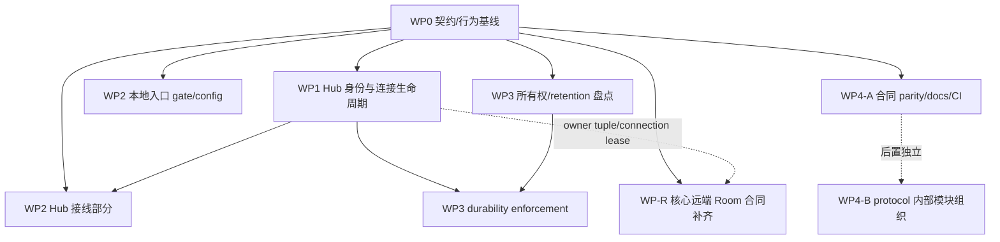

# 渐进重构计划

> **状态：计划草案，未执行。** 本文只描述未来可执行的工作包、依赖和验收；本轮只同步路线图，不实施代码、协议、配置或产品变更，也不表示任何实现已经批准或落地。
>
> **权威决策：** 本计划按 [D01–D08 用户已确认的架构整理决策](decisions.md) 编排。D01–D08 已确定本轮的产品边界和工程取舍，但不替代实施时对具体合同、权限机制、数据保留或恢复细节的技术设计。
>
> **调查基线：** 2026-09-16。事实引用来自源码定位和本次只读调查；本路线图未执行实现或验证，不能把计划中的 smoke、测试、部署或迁移步骤理解为已经完成。
>
> **阅读前提：** 先读 [现状架构](current-state.md)、[问题诊断](diagnosis.md)、[目标架构](target-architecture.md)、[工程规则](engineering-rules.md) 和 [已确认决策](decisions.md)。本计划不取代接口、配置、运维或开发手册。

## 1. 目标、边界与状态标记

目标是在保留当前五个 Rust crate 和既有部署拓扑的前提下，先把每个 crate 内的边界收紧，再以小而可回退的提交迁移调用方。五个 crate 是 `agentic-gpt`、`agentic-gpt-hub`、`agentic-gpt-protocol`、`agentic-apply-patch`、`agentic-browser-host`；不因架构整理新造 service、crate 或通用框架。

目标系统仍是 **Agent 的受控执行基础设施**：

- Agent 拥有本地 policy/confirmation、process/jobs/terminal、files、network/downstream MCP、browser lease、skills 和 Room 文件资源；`local_service` 及其后的执行模块是实际效果的 owner。
- Hub 仅拥有入口、action/OAuth 认证、Agent registry、连接/代际、dispatch、confirmation coordination、run receipt、历史与有限 projection；它不执行 Agent 主机上的 shell、tmux、MCP、Browser 或 Room 文件写入。
- `agentic-gpt-protocol` 只拥有 wire DTO、枚举、envelope 身份和必要的纯契约规则；不吸收 I/O、数据库、执行器或业务服务。
- `agentic-apply-patch` 保持纯独立算法；文件策略、路径锁、revision、确认和提交继续在 Agent 的 `file_ops`。
- `agentic-browser-host` 是独立的浏览器扩展 bridge 进程，不伪装成 Agent 的 Browser SDK、lease 或核心执行器。
- stdio、HTTP、local Unix socket、Hub WS/SSE/MCP 是入口适配器，共享应用操作，不互相调用对方的 transport DTO；TUI/Console 是交互适配器。
- Android attention 是现有 local-only 功能，权威数据在 Android 本地 Room，OS alarm/notification 只是副作用；不自动发展 Hub reminder/task scheduler。
- Room 保留受控文件、文档与维护能力，但不是长期推理记忆、上下文管理或通用 memory subsystem；远端 Room 能力由核心 WP-R 补齐。
- 公开合同若需破坏性调整，部署按一次协调升级处理：迁移仓库内全部 caller，并在实现交付时同时提供真实可执行的迁移步骤。不得预置长期 alias、shim、双轨执行或新的 version/feature 协商机制。

### 状态标记

- **[事实]**：调查以相对路径、符号和当前实现为依据。
- **[推断]**：由事实推导的结构风险或维护成本，不等于已复现故障或已确认漏洞。
- **[未验证]**：本次只读调查未运行的场景、外部组件或部署行为。
- **[用户决策]**：D01–D08 已记录在 `decisions.md`；只有超出这些边界、改变公开行为/权限/数据用途或扩大产品范围的新取舍才需要新增确认，不重复审批已确认原则。
- **[技术决定]**：在不改变 D01–D08 合同的情况下，维护者可自行选择实现细节；具体合同、retention、auth 和恢复机制在所属工作包实际碰到时按证据细化。
## 1.1 与正式诊断编号的对应

本计划统一使用 `diagnosis.md` 的正式编号 **A01–A09**；调查报告中的严重度/P 编号仅是原材料索引，不作为本路线图的风险编号。A 编号表示需要核验或处理的主题，不表示每项都是已证实漏洞。

| 正式诊断 | 主题（以 `diagnosis.md` 为准） | 主要工作包 | 计划中的处理边界 |
|---|---|---|---|
| A01 | 多份公共合同缺少语义一致性门槛 | WP0、WP4-A | 先冻结差异，再以真实 decode/dispatch/response 选择技术上的 adapter 或 spec cutover；一次升级迁移全部 caller |
| A02 | Room 接口 cutover 未跨端完成 | WP0、WP-R | WP0 记录断裂；核心 WP-R 补齐所需远端读与维护语义、完成 Hub→Protocol→Agent 闭环，并 clean cutover，不等待另立远端项目 |
| A03 | tool visibility、capability、authorization 分散 | WP2 | 最小 crate 内 operation gate；不造大 capability registry，不改变既定权限默认 |
| A04 | Hub 连接、run、waiter 所有权未形成同一不变量 | WP1 | 绑定 connection/run/request/hash owner；区分可靠迟到结果与当前连接状态 |
| A05 | 配置可变性与启动派生资源不一致 | WP2、WP3 | 分层 startup-only/live-safe/restart-required，避免 config 与派生资源分裂 |
| A06 | “受控”被不同机制赋予不同保证 | WP2、WP3 | 按 D04 保持安全默认、不升级公网多租户威胁模型；记录 policy/sandbox/external trust，具体 auth 机制在遇到时细化 |
| A07 | 持久化、等待和投影缺少一致语义说明 | WP1、WP3 | 按 D06 分层 durability、retention、freshness 和恢复状态；不把 best-effort 当 durable，接受 Hub 临时状态重启失效 |
| A08 | Console 原型/本地能力与远端控制定位不清 | 独立维护参考 WP5、WP5-O | Android attention 保持 local-only；Console Hub 是独立产品，均不进入核心 DAG、里程碑或完成门槛 |
| A09 | 当前规范、历史说明与验证工具保证混在一起 | WP0、WP4-A、WP4-B、全局核验 | 明确 authority/状态；历史版本不因旧就判 bug，evaluator 不冒充 runtime 验证 |

## 2. 当前到目标的落地路径

路径约定：代码引用使用仓库根相对路径；同一表格行中后续文件若省略目录，沿用该行首项目录。工作包中的短文件名同理，首次出现时以所属 crate/模块为准。

| 当前实现/入口 | 目标内部边界 | 迁移原则 |
|---|---|---|
| `crates/agentic-gpt/src/stdio_server.rs`、`crates/agentic-gpt/src/local_control.rs`、`crates/agentic-gpt/src/http_server.rs` | Agent ingress adapters：MCP framing/schema、local peer/auth、HTTP auth/session | 入口只解析、认证、形成 `RequestContext`；操作和策略不在每个 transport 重写 |
| `crates/agentic-gpt/src/hub.rs`、`crates/agentic-gpt/src/local_service.rs` | Hub envelope adapter + Agent operation core | Hub command 进入同一 operation gate；保留 `run_id/request_id/command_hash`，不复制执行循环 |
| `crates/agentic-gpt/src/jobs.rs`、`policy.rs`、`confirmation.rs`、`exec.rs`、`file_ops.rs`、`mcp.rs`、`tmux.rs`、`skills*`、Room modules | Agent execution/resource domains | 权限、确认、效果、Job 状态和资源 owner 在 Agent；`apply-patch` 仍只做纯变换 |
| `crates/agentic-gpt-hub/src/main.rs`、`routes.rs`、`mcp_server.rs`、`agents.rs`、`runs.rs`、`room.rs` | Hub control-plane modules | 统一 owner/connection/run 校验；HTTP 和 Apps MCP 共享应用操作，不调用彼此 transport |
| `crates/agentic-gpt-protocol/src/lib.rs` | 按 domain 的 wire/envelope/contract 内部模块（仍是一个 crate） | 保留 serde 名称、camelCase、消息字段和版本边界；模块化不等于扩大协议职责 |
| `openapi/hub.yaml`、Agent descriptors、Hub schemars、`tool-contract-matrix.md`、`cases.json` | 各自明确 authority、版本和 parity gate | 先做差异表，再由维护者按证据更新 spec 或增加显式 HTTP adapter；迁移全部 caller 后 clean cutover，迁移步骤随实现交付，不预置新 version/flag |
| `agentic-browser-host` | 独立高权限 external bridge | 维持用户报告的本地进程/容器/共享目录/Unix socket 拓扑；先盘点实际边界，再选择 peer/auth 机制，不远程暴露 |
| Console Android Room/Alarm/Notification 与 Desktop/Web placeholder | 独立 local attention 维护边界；未来 Hub client 另作产品 | 不把 `AttentionSourceKind.Hub` 预留字段伪装成已接入；Console 参考工作不阻塞核心重构 |

### 2.1 依赖图与并行安排

- **WP0 是共享事实输入，不是把核心工作包串成单线瀑布。** WP0 完成可复核的 baseline 后，WP1、WP2 本地 gate/config、WP3 所有权盘点、WP4-A 合同 parity 和 WP-R 的合同/Agent 侧工作按上图真实依赖并行推进。
- WP2 的 Hub 接线只等待 WP1 的 owner tuple/connection context；WP3 的 enforcement 只等待 WP1 的状态规则，盘点本身可并行。WP-R 可先完成 Room 能力与 Agent repository seam，Hub adapter 在消费 WP1 owner/lease 合同时收口；它不是另立项目或“是否需要远端 Room”的等待点。
- WP4-A 不等待 WP1、WP2、WP3 或 WP-R 才能开始；WP4-B 是纯内部组织的后置可选维护包，不阻塞任何核心合同修复。
- WP5 Android local attention 与 WP5-O Console Hub 只作独立维护/产品参考，刻意不出现在核心 DAG；Console、未决未来威胁升级和其产品立项不能阻塞 WP0/WP1/WP2/WP3/WP4-A/WP-R。
- 同一 ingress/domain 同时最多有一个行为变更提交；未来实现按包运行窄范围 targeted smoke，`cargo test --workspace` 及完整发布 gate 只在适用里程碑/发布候选运行。本轮文档更新未执行这些验证。

## 3. 不可回归的行为保护清单

以下清单是核心工作包的共同不可回归门槛；WP5/WP5-O 的独立参考工作只在自身维护或另立产品时适用，不构成核心完成条件。除非 D01–D08 之外出现新的明确决策，重构不得改变这些语义：

1. **权限不放宽。** 未经决策不得因统一 gate、路由迁移、schema 兼容或 profile 重构增加 process、file、MCP、tmux、skill、Room、Browser 或 notification 能力。
2. **等待不是取消。** Hub/HTTP/MCP 的 waiter timeout 只结束控制面等待；不得把它写成已取消远端 Job。应区分 `wait_expired`、`remote_unknown`、`cancel_requested` 和真正的 terminal result。
3. **身份分离。** `run_id`、`request_id`、`connection_id`、Agent identity、Job identity 不互相替代；late/duplicate result 必须校验 owner tuple，不能仅凭全局 request id 唤醒 waiter。
4. **代际隔离。** 当前 connection 的 metadata、Heartbeat、Job projection、RunReport 与旧 connection 的可靠补交是不同路径；旧连接不能借迟到消息改写新连接状态。
5. **真实状态与 projection 明确。** Hub Job cache、run receipt、Agent Job history、transport ledger、audit、Console Room/Alarm 都要标明 authoritative、projection、ephemeral、stale 或 unknown；缓存不得被当作执行事实。
6. **Room 所有权不迁移到 Hub。** Hub active Room 只是 connection lease/routing；Diary、Notebook、State、Git、schema/scaffold 和 maintenance 写入继续由 Agent Room repository 持有。
7. **既有 Console 不破坏（兼容约束而非核心交付）。** Android 本地 Room 仍是 attention authority；不能将本地 item、AlarmManager 成功或 Android placeholder 解读为 Hub remote run/notification 成功。Console local-only 维护不阻塞核心包。
8. **公共兼容先盘点、一次升级收口。** 先盘点既有 camelCase、工具名、HTTP path/status、Protocol serde 名称、部署拓扑和 release 入口，再由技术维护者选择 spec/adapter、迁移全部 caller 或明确退场。破坏性变更的迁移步骤必须随实现交付；不要添加永久 alias、shim、双轨、version field/feature flag 或协议协商。
9. **外部效果诚实标记。** downstream MCP、Browser JS、tmux server、tunnel child 和 browser-host bridge 是 external/trusted effect，不能因有 job/audit 包装就声称已受 generic process sandbox 完整约束。
10. **配置派生资源一致。** startup-only identity、workspace、runtime/socket、Browser descriptor、history/install roots 和 Hub identity 不能在 live reload 后与 `state.config` 分裂；live-safe 字段与 restart-required 字段必须分层。
11. **D04 安全默认不擅自改动。** `policy` 显式 allow 覆盖内置 deny、sandbox 默认 disabled 等既定语义在本轮保持不变；不扩大公网多租户威胁模型。应诚实标记 policy/sandbox/external trust，遇到具体 auth 边界再在相关包细化。
12. **证据不夸大。** 旧 release/migration 文档中的版本、计数是历史材料，不能仅因旧就判为 bug；合同/运维入口只有在其声称“当前”且与 authority 不符时才进入清理范围。预测 evaluator 只能证明预测 shape，不能代替 runtime dispatch。

## 4. 工作包

### WP0：契约/行为基线（第一道门）
**对应正式诊断：** A01（合同 parity）、A02（记录并输入 Room cutover）、A09（规范/验证边界）；本包只冻结事实和验证输入，不实现 Room 迁移。

**目的与证据**

- [事实] `Cargo.toml` 当前是五 crate；`agentic-gpt`、Hub 依赖 protocol，只有 Agent 依赖 apply-patch。部署边界不能按过时的“三 crate”说明设计。
- [事实] 同一公共能力分散在 Protocol serde、Agent `stdio_server.rs` 手工 descriptor/validation、Hub `mcp_server.rs` schemars、`routes.rs` HTTP DTO 和 `openapi/hub.yaml`。`docs/tool-contract-matrix.md` 是 review aid，不是 runtime schema。
- [事实] Hub `room.rs`/`mcp_server.rs` 的 Full profile 仍广告并调用 `RoomNotebook*`/`RoomDiary*`；Agent `local_service.rs` 对这些命令明确返回 `room_legacy_surface_removed`。当前 Agent 的真实 Room 面是 `room.diary.active/read`、notebook read/recent/search、state 和 `room.maintenance.submit`。本包记录可达断裂和所需远端能力输入，核心修复另列 WP-R。
- [事实] OpenAPI/实际 DTO 的已知差异包括 `JobInfo.startedAt` required vs Protocol `Option`；Job list 的 `group/cursor/nextCursor` 和 limit 100 vs 实际默认 50；Job get 的 `waitOnly`、`waitSeconds` 默认 5（descriptor）vs dispatch/OpenAPI 0；cancel 200 的 `JobDetail` vs 实际 `JobCancelResponse`；Notebook `selectExact` 的 `year/month/day` vs Protocol `date`；Notebook append 的 `significance`/`abstract` required vs 实际 default/Option。
- [未验证] 本次没有真实 Hub↔Agent Room HTTP/MCP、严格 Actions importer 或外部 Apps 客户端验证；现有 Hub Room 单测主要证明 fake connection routing，不能证明 live parity。

**范围**

1. 建立“入口 × 工具/命令 × request/response × authority × 版本 × 行为”的基线表，覆盖 Agent 29/40 live surface、Hub Full/Coordinator、OpenAPI、Room（含断裂）、Job、Skill、Browser、Console local-only、timeout/confirmation。
2. 为每项标记 [事实]/[推断]/[未验证]，冻结可重放的 shape、错误、状态和权限样例；不为了让表格整齐先改代码。
3. 对 A02 登记现有 Hub Room surface、当前 Agent 拒绝结果、已知 caller/使用证据和所需远端读/维护能力，形成 WP-R 输入；WP-R 不得以“等待另立项目”或仅隐藏工具代替修复。
4. 将 OpenAPI drift、Skill wait 上限、evaluator shape-only 限制和历史/current 文档分层登记为 WP4-A 输入；不在基线包同时改协议。

**非目标**

- 不实现 Room adapter、Hub Room 文件写入、Room 数据搬迁或 legacy 清理；这些由 WP-R 按一次升级 clean cutover 完成。
- 不删除 `room_repository`、Git/scaffold、maintenance、当前 Agent Room 只读能力或 Android local attention。
- 不把历史 release/migration 文档的旧数字本身当缺陷；不把调查严重度/P 编号当正式风险编号。
- 不运行全仓验证；基线只产生差异表、样例和后续窄范围 smoke 方案。

**前置依赖**

- `current-state.md`、`diagnosis.md` 的 A01–A09 事实，以及本计划第 3 节不可回归清单。
- 不要求先作 Room 产品决策即可完成基线；使用方/旧客户端证据缺失只标为证据缺口，不得把 WP-R 置于停止状态或以永久 unsupported 代替远端能力修复。
- [技术决定] 差异表格式、样例存放方式和 baseline harness 可自行选择，但不能形成第二套 authority。

**分阶段提交（未来实施时的提交边界；本任务未创建）**

1. `docs(contract): freeze ingress and behavior matrix`：仅基线、authority、事实等级和未验证项。
2. `docs(contract): record Room cutover fracture and required remote capability inputs`：只登记 A02 的当前可达链和迁移输入，不修改 route、protocol 或文件。
3. `smoke(contract): capture current shape and lifecycle baselines`：运行最小入口/shape 场景，将结果交给 WP-R/WP4-A；探索性检查不堆积为永久 plumbing 测试。

**既有验证入口（均未执行）**

- Agent `stdio_server.rs`：`normal_and_room_tool_sets_follow_fixed_surface_contract`、`deterministic_tool_contract_corpus_exercises_public_dispatch`、Room/skill dispatch 相关测试。
- Protocol `lib.rs`：`job_info_can_represent_not_started_without_fabricated_timestamp`。
- Hub `room.rs`：active Room 选择、冲突、重连、旧连接断开和路由测试；Hub `mcp_server.rs`：Full/Coordinator 工具过滤与 descriptor 测试。
- Agent `crates/agentic-gpt/tests/local_control.rs`：当前本地 surface 不广告旧 Room write tools；Hub route/OpenAPI string tests 可用于 shape baseline。
- 可复用 smoke：`agentic-gpt config init --mode local ...`、`agentic-gpt local list-tools`、Hub `init/serve` 后调用 `/v1/info` 和 Apps `/mcp`。

**真实场景验收**

1. 对 Agent local surface、Hub Full/Coordinator、HTTP/OpenAPI 的工具/字段/错误/状态做一次可重放采样，明确哪些是 runtime authority、哪些只是 projection。
2. 用真实 Agent 记录 Hub Full 旧 Room 命令到达后的 `room_legacy_surface_removed`；验收是“断裂被准确记录”，不是本包把它修成成功。
3. 对 queued Job 的 `startedAt`、分页 `nextCursor`、cancel response、Notebook date 和 Skill wait 边界留下跨包可重放样例；不能将静态 schema parse 当成功。
4. 记录 run/job/connection identity、timeout 非取消、late/duplicate owner 规则和 Console local-only 事实，作为核心 WP1/WP2/WP3/WP4-A/WP-R 输入；Console 的本地维护仍独立。

**回退、数据与协议兼容**

- 本包无生产行为变更，因此回退只删除/恢复基线文档和一次性样例，不触碰 Room 文件、Git、Hub DB、Agent ledger 或 Console DB。
- 只记录既有 names/fields/path；不为基线强制新增 feature flag、version field、re-export、alias 或双轨。后续由相应工作包按 D03 迁移全部 caller，并在实现交付时补齐真实迁移步骤。

**完成门槛**

- A01/A02/A09 的事实、推断、未验证边界和 authority 已可复核；Room 断裂被记录但没有假装已修复。
- 每条 OpenAPI/Protocol/descriptor drift 都有下一工作包归属、兼容影响和验证入口；没有以“文档已更新”替代行为证据。
- WP1、WP2、WP3、WP4-A 和 WP-R 可在该基线后按真实依赖并行开工；WP-R 是核心合同修复，不等待另立项目。WP4-B 与 WP5/WP5-O 不属于核心启动条件。

**停止条件**

- 发现 baseline 与源码/CodeGraph 不一致、无法判断现行 authority 或只能用静态描述推断 runtime 行为时，停止写入“已确认”结论；这不是把已确认的远端 Room 需求退回产品审批。

### WP-R：Room 公开合同收口（核心远端能力补齐）
**对应正式诊断：** A02（Room cutover）。本包是核心合同修复，不是可选项目：按 D02 补齐所需 Room 远端读与维护能力的 Hub→Protocol→Agent 端到端语义，迁移全部 caller 并按 D03 clean cutover。具体 operation shape、错误和权限投影在实现时按证据细化，不改变 Room ownership。

**目的与证据**

- [事实] Hub active Room 只保存 `agent_id + connection_id` 路由租约；Room 文件、Git、schema/scaffold、diary/notebook/state read 和 maintenance 由 Agent repository 持有。
- [事实] Hub Full 仍广告旧 `RoomNotebook*`/`RoomDiary*` 工具，当前 Agent 对十个旧 command 返回 `room_legacy_surface_removed`；Coordinator 不广告这些工具。
- [未验证] 没有真实 Hub↔Agent Room read/maintenance E2E，也没有完整旧客户端使用清单；这些是实现与迁移时要补的验证输入，不是决定“是否需要远端 Room”的前置审批。

**范围**

1. 以 WP0 的现状链为输入，技术上确定并实现所需的远端 Room 能力集合，至少覆盖实际需要的受控读与 maintenance 语义；每项注明 producer、调用方、authority、写入语义和错误/生命周期投影。不得因没有另立项目就跳过能力。
2. 对所需能力实现明确 Hub adapter/route 到当前 Agent 合同：读操作映射到 current read，写操作仅在 maintenance 语义完全等价时映射。不得把旧 append/update 语义静默改写成不等价 maintenance，也不得让 Hub 形成第二份 Room 内容。
3. 对仍广告但确实被替代的旧 command，随同 caller 迁移和合同更新明确退场；不得仅隐藏工具、返回永久 unsupported、返回空成功，或以 legacy 名称掩盖遗漏。未证明语义等价时保留明确错误只可作为迁移期间的临时事实，不是最终实现。
4. 迁移仓库内全部受影响 caller 后清理被替代旧路径；一次升级 clean cutover，不新增 version field、feature flag、alias、shim、双轨执行或协议协商。真实迁移步骤和版本/产物组合、备份、升级顺序、验证与回退边界随实现交付，当前计划不编造命令或版本号。

**非目标**

- 不把 Room 内容、Diary/Notebook/State 或 Git metadata 放入 Hub；不把 Room 变成长期记忆、context manager 或 scheduler。
- 不改变 Agent Room path/symlink/Git/maintenance 安全链，不删除当前 Agent local surface。
- 不为无调用方证据的旧 alias 保留永久 shim；不把未完成的远端能力标成永久 unsupported，也不把 WP-R 变成 Hub-owned Room content store 或所有 Room 工具的无证据大迁移。

**前置依赖**

- WP0 完成 A02 的当前链和 shape baseline；WP-R 可据此与 WP1、WP2、WP3、WP4-A 并行推进。
- WP1 不是 WP-R 的启动硬前置，但 Hub adapter 收口必须消费其最终 owner tuple/connection lease 规则；WP4-A 的 HTTP contract parity 可并行。
- [技术决定] 远端 operation 的精确输入/输出、公开名称/路径、错误、权限投影、caller 迁移顺序和 maintenance seam 由维护者按 D01–D03、源码证据和真实 smoke 选择；不把产品审批或新 compat/version 机制设为前置。

**分阶段提交**

1. `docs(room): freeze remote capability contract and migration inputs`：记录所需能力、authority、错误、生命周期和 caller 迁移边界，不把是否远端列为选择题。
2. `refactor(room): adapt required Hub operations to Agent contract`：一次只迁移一个语义闭环，不把 Hub 变成文件 owner。
3. `smoke(room): exercise required live Hub-to-Agent paths`：验证真实 decode、dispatch、Agent repository 读/维护和结果 shape。
4. `cleanup(room): migrate all callers and retire replaced legacy paths`：调用方全部迁移、有 live 证据后清理；同时交付真实迁移文档步骤，不以 unsupported 或隐式 fallback 结束。

**既有验证入口（均未执行）**

- Hub `room.rs` active Room/冲突/重连/路由测试和 `mcp_server.rs` Full/Coordinator descriptor/dispatcher tests。
- Agent `stdio_server.rs` current Room surface、`local_service.rs` legacy error、`room_reads.rs`/`room_repository.rs`/`room_maintenance.rs` 的实际资源入口。
- Agent `crates/agentic-gpt/tests/local_control.rs`、Hub routes/OpenAPI tests；它们只能作为 targeted 入口，不能替代跨进程 live smoke。

**真实场景验收**

1. 启动真实 Hub、active Room CommandCapable Agent 和至少一个 Normal Agent；从所需 HTTP/MCP operations 触发 Room read/maintenance，确认无 active Room、非 Room、ReportingOnly 和 stale connection 都得到正确错误。
2. 对所需读操作确认返回来自 Agent repository 的 bounded 内容；对 maintenance 写操作确认 path/Git/maintenance lock/expected change/confirmation 仍由 Agent 执行，Hub 不产生第二份文件。
3. 对替代的旧工具，确认已实现等价 adapter 或随全部 caller 迁移明确退场；不得只靠隐藏、永久 unsupported、空成功或失败伪装成当前工具结果。
4. 在 caller 迁移后重新列 Full/Coordinator/Agent surface，确认没有 stale advertisement；Console Android local Room 不受该包影响。

**回退、数据与协议兼容**

- 先迁移单个 operation，回退时保留 Agent Room 文件/Git/maintenance journal，不运行删除性数据迁移。
- 纯内部组织不改变 wire/serde；补齐远端合同时若需修改命令或HTTP/MCP形状，按实际语义与WP4-A校准，一次升级迁移全部caller和相关数据读取路径，不为历史形状新增version/flag或兼容双轨。
- 旧 command 在迁移窗口内只能得到明确的旧合同结果；最终要么由已验证 adapter 承载，要么在全部 caller 迁移后 clean cutover 退场，不添加隐式 fallback 或永久 alias。

**完成门槛**

- 每个所需远端 Room 能力都有真实 Hub↔Agent decode/dispatch/response/文件 owner 证据；Hub 不持有 Room content store。
- 全部受影响 caller 已迁移或得到明确、有边界的 clean-cutover 退场结果；Hub Full/Coordinator/Agent surface 不再无理由广告被替代路径，且迁移文档步骤与实现一起交付。
- WP1、WP2、WP3、WP4-A 与 WP-R 的其余工作按图中真实 seam 收口；WP-R 不要求 WP5 或 WP5-O 完成。

**停止条件**

- 只能通过 Hub 持有/解释 Room 文件、静默改变写语义、无 owner fallback、仅隐藏工具或永久 unsupported 来“通过验收”时，停止并回到 ownership/contract 实现，而不是退回“是否需要远端”的产品决策。
- 没有 live E2E 或 caller 迁移证据却准备删除/退场旧路径时，停止清理；继续补齐实现与迁移证据，不建立旧 compat 双轨或新 version 机制。

### WP1：Hub 身份与连接生命周期
**对应正式诊断：** A04（Hub connection/run/waiter owner）；只处理已定位的不变量和未验证竞态，不预先宣称远程漏洞。

**目的与证据**

- [事实] Hub `state.rs` 分开保存 Agent registry、当前 connection、pending waiter、Job cache、boot generation、active Room、confirmation 和 run receipt；`agents::request_agent` 目前将 waiter 放入全局 `pending[request_id]`。
- [事实] SSE `post_agent_message` 会拒绝 stale 的非可靠消息，但 WS socket reader 调用统一 handler 时没有同等的 current connection 门槛；旧连接的 Hello/Heartbeat/JobUpdate/RunReport 竞态影响尚未被真实复现。
- [事实] `runs::store_result` 会按 `agent_id/run_id/request_id` 尝试匹配和幂等存储，但 Response handler 忽略匹配结果，仍按 `request_id` 移除 pending waiter 并发送 data。
- [事实] reliable envelope 已有 `event_id/run_id/request_id/command_hash`、Agent transport ledger、ACK、duplicate/hash mismatch、boot generation 和 replay；这些是应加固的基础，不应被重写为新的执行器。
- [事实] confirmation pending 只在 Hub 内存保存，断线时状态可能标为不可用但未立即通知原 Agent waiter；旧 callback/新 connection 的绑定也未完整建模。
- [推断] 上述不对称可能污染当前 connection metadata、Job projection、run history 或同步 waiter；per-agent secret 和关闭竞态限制了可利用条件，不能在计划中夸大为无条件跨 Agent 漏洞。
- [未验证] 没有真实 old-WS replace/close 竞态、foreign Response、Hub restart/replay 和 confirmation disconnect 场景证据。

**范围**

1. 引入 crate 内部最小 `ConnectionHandle`/owner validator 概念，至少绑定 `agent_id、connection_id、mode、role`；不新造全局 capability registry。
2. 将 pending value 绑定 `(agent_id, run_id, request_id, command_hash)`，Response 只有 owner tuple 匹配且 durable result 为合法的新结果/幂等重复时才能唤醒 waiter。无 run id 的旧路径不得服务新的受控执行；迁移全部 caller 后按 D03 clean cutover，不以旧 compat、alias 或新 version 协商掩盖 owner 缺失。
3. 统一 non-reliable 与 reliable inbound 规则：当前代际才可更新 Heartbeat、Hello metadata、Job projection、非可靠 report；旧代际只可补交与 DB 中完全匹配的可靠结果/ACK/status，且不能改当前连接属性。
4. 绑定 confirmation 到 connection/run/request；断线应以明确的终止结果结束原 waiter，callback 不得按裸 Agent id 投递给无关新连接。
5. 区分 `not_sent`、`sent_no_ack`、`acked_running`、`wait_expired`、`remote_unknown` 和 `cancel_requested`；确认 Hub waiter timeout 不会取消远端 Job。

**非目标**

- 不改变 action API 的认证强度、Agent secret 算法、Hub/Agent 部署拓扑或产品权限矩阵。
- 不因为“更严格”而拒绝有合同依据的 late reliable result；目标是验证 owner，不是禁止幂等重放。
- 不将 Hub 做成 executor、Job owner、Room repository 或长期 confirmation store；按 D06，OAuth/session、pending confirmation 和 Job cache 等 Hub 临时投影允许重启失效，不得把失效解释为已取消或已完成。
- 不把所有旧客户端 request 永久兼容；按 D03 迁移全部 caller 后清理无 owner 的隐式路径，不凭空新增 version field、feature flag 或双轨执行。

**前置依赖**

- WP0 已冻结 run/request/connection baseline；WP-R 的 Room 迁移不构成本包前置，WP1 可与 WP2 本地 gate、WP3 盘点、WP4-A 和 WP-R 合同/Agent 侧并行。
- [技术决定] 无 run id 的旧响应处理、断线 confirmation 的公开错误映射、DB 条件更新方式和 message 分类由维护者按现有证据选择；不得以此新增 compat/version 机制或阻塞独立包。
- [技术决定] validator 的内部结构可自行选择，只要满足 owner tuple、单调状态转换和 D06 的易失 Hub session 语义。

**分阶段提交**

1. `refactor(hub): add connection handle and owner validation`：先覆盖入站校验和诊断，不迁移公共 API。
2. `fix(hub): bind pending responses to run owner`：Response/ACK/status 使用完整 tuple；mismatch 进入 conflict/error，不消费别的 waiter。
3. `fix(hub): close confirmation waiters by connection generation`：断线、替换和 callback 使用相同 connection/run/request owner。
4. `refactor(hub): separate wait timeout from remote execution state`：补齐原因/状态 projection；保持 late result 可验证落库。
5. `cleanup(hub): migrate callers and retire unowned response fallback`：迁移结束后移除无 owner 的隐式路径；不建立旧 compat 双轨或新增 version 字段。

**既有验证入口（均未执行）**

- Hub `agents.rs`：boot generation、pending replay、stale SSE heartbeat/JobUpdate、matching-run late Response、send failure、ReportingOnly target rejection、过期连接清理。
- Hub `runs.rs`：late idempotent result、stale acked→unknown、Agent report upsert。
- Hub `main.rs`/`notify.rs`：confirmation action、bearer、safe info summary。
- Agent `hub.rs`/`transport_ledger.rs`：Hello、reliable envelope、duplicate/hash mismatch、reconcile。
- 现有验证不覆盖 old WS reader、mismatched Response 消费 waiter、confirmation disconnect waiter，必须用真实场景补证据，而不是把现有 SSE 测试宣称为完整证明。

**真实场景验收**

1. 建立同一 Agent 的新旧 WS/SSE connection，替换后让旧连接发送 Hello、Heartbeat、JobUpdate、RunReport；旧非可靠消息不改当前 metadata/cache，日志/状态能说明 stale。
2. 让旧连接补交一个 DB 中完全匹配 `(agent,run,request,hash)` 的 reliable Response，验收一次完成或幂等，不重复执行；再发送 foreign/mismatched tuple，验收不消费当前 waiter、不覆盖已完成结果。
3. 同一 request id 在不同 run/connection 上竞争，确认只有 owner waiter 获得结果；Hub HTTP/MCP 的同步超时后远端 Job 仍可继续并最终产生 late/unknown 事实。
4. sender 发送失败后检查调用方错误、Hub run 状态和重连 replay：未进入 transport 的记录不得伪装成可重放命令；ack 未知必须显示为 unknown，而不是已取消或已完成。
5. 在 confirmation 等待中断开旧 connection，确认原 Agent waiter 在有界时间内收到终止结果；新 connection 不能收到旧 confirmation decision。
6. 重启 Hub，确认 SQLite run receipt 保留、内存 waiter/cache/active Room/OAuth session 按文档消失，Agent ledger 能防止重复副作用；不得声称原同步 HTTP waiter 被恢复。

**回退、数据与协议兼容**

- 先在内部校验和观测层落地，按 message 类别切换；发现真实 caller 依赖旧 fallback 时先迁移 caller，不放宽新 owner 校验，也不为其增加长期兼容层。
- 对旧 DB run 不做 destructive migration；新增状态/原因用可读的 additive schema 或兼容映射，旧记录仍可查询。不能把 `unknown` 改写成 `cancelled`。
- 协议 field/name 不改；一次升级迁移全部 caller 后 clean cutover，回退不得重复执行 late/duplicate，也不得依赖新增 version field/flag。

**完成门槛**

- 所有 inbound message 都有 documented owner rule；WS/SSE 不再因入口不同而拥有不同的安全语义。
- Response mismatch 不会消费无关 waiter；可靠 late result 仍能完成合法 run；confirmation 与 connection generation 闭环。
- run 状态可区分等待、远端效果和 unknown；验证清单中所有“未验证”项有真实 smoke 结果或明确保留为未验证并阻止删除旧保护。

**停止条件**

- 只能靠按 Agent/request id 的宽松 fallback 通过既有测试时，停止切换并迁移 caller；不得为未知依赖凭空新增版本/flag或旧 compat 双轨。
- 任一 mismatch 能唤醒 waiter、改写新连接 metadata 或覆盖已完成事实；停止后续迁移。
- 需要改变 D04 已确认的权限/安全默认、取消语义、secret 生命周期或部署拓扑才能通过时，停止该包并另立范围；未来 threat model 升级不构成核心包前置。

### WP2：入口应用边界与最小 operation gate
**对应正式诊断：** A03（visibility/capability/authorization）、A05（config mutability/derived resource）、A06（不同机制的受控保证）。

**目的与证据**

- [事实] Agent 的 `RuntimeModel::{hub,tunnel,local}` 和 `Capabilities` 在 `state.rs` 表达有意的 mode/profile 差异；`local_service.rs` 是共享 value-returning operation layer。Local Unix、Tunnel stdio、Standalone HTTP、stdio 和 Hub command 最终应复用它们。
- [事实] `stdio_server::dispatch_with_lifecycle` 与 `local_service::dispatch_inner` 都维护工具/HubCommand 映射及错误/兼容转换；Agent 与 Hub 又各自维护 tool description、`read_only/destructive/open_world` 列表。这是 metadata/gate 漂移，不能直接判定为重复执行器。
- [事实] `stdio_server` 的部分 `skills.*`/`room.*` 直达 `skills`/`room_reads`，未统一调用 `local_service::require_capability`；`config_cli` 可直接 enable Room toolset；CLI tmux create/close 绕过 AppState、confirmation、audit；MCP annotations 当前是 consumer metadata，不是 authorization gate。
- [事实] Hub routes、Apps MCP、stdio/local/HTTP 都是入口适配器；入口不应调用彼此 transport DTO。
- [事实] Hub whole-config watcher 只检查 mode/profile，可能替换 startup/ownership 字段；Standalone 已有较窄的 live-safe subset。`build_app_state` 创建的 private state、job history、skill install、Browser runtime 和连接资源未随 Hub 热加载整体重建。
- [推断] 入口差异可能使同一 profile 在不同 surface 获得不同能力、审计或确认语义；配置 reload 可能使 identity、workspace、Browser 和持久化 roots 与新 config 分裂。是否达到安全漏洞等级取决于 threat model 和实际可达配置来源。

**范围**

1. 在 Agent crate 内形成最小 `RequestContext + operation gate`：从 ingress 带入 mode/profile/transport/peer/auth/operation/effect，统一检查 toolset visibility、RuntimeModel capability、policy/confirmation 前置条件和 resource owner。它是内部边界，不是新 crate 或大而全 capability registry。
2. 让 stdio、local Unix、HTTP、Hub command、CLI tmux、Room/Skill/Browser direct route 都在进入 operation core 前经过同一 gate；`local_service`/执行模块仍是唯一 operation result owner。
3. 保留入口专属职责：stdio 做 MCP framing/schema/resume，HTTP 做 bearer/OAuth/Host/Origin，local Unix 做 UID/socket，Hub 做 envelope/replay，TUI 继续 observer；入口不得互调 transport DTO。
4. 将 descriptor/annotation 用于发现和 client UX，将真正 authorization/effect gate 与 descriptor 生成分离但共享 operation metadata，避免“广告了 destructive”被误当“已经阻止”。
5. 对配置字段建立 `startup-only`、`live-safe`、`restart-required` 分类：agent identity、workspace/root、runtime/socket、Browser descriptor、history/install location、Hub connection identity 等派生资源默认视为 startup-only；policy、limits 等能安全重载的子集必须有明确更新顺序和 rollback。若改变 startup-only 字段，显式要求重启，而不是替换一半 `AppState`。
6. 对 generic process policy、sandbox、MCP stdio、Browser JS 和 tmux 等 external effect 记录真实 trust 边界。按 D04 保持 `policy` 显式 allow 覆盖内置 deny、sandbox 默认 disabled 等安全默认，不扩大公网多租户威胁模型；具体 auth/隔离机制在实际包内按证据细化，不把未来升级设为本包前置。

**非目标**

- 不创建永久 capability registry、通用 authorization service、新 crate 或全仓重写。
- 不因统一 gate 自动扩大 deny、强制打开 sandbox、禁止管理员显式 allow，或改变任何既有 profile 默认值；D04 已决定本轮保持这些语义，未来改变须另立安全变更。
- 不把 Browser arbitrary JS、MCP downstream server、tmux server、tunnel child 伪装成已经被 Agent generic sandbox 完整隔离；但也不因此删除现有能力。
- 不让 Hub、Console 或 TUI 直接拥有 Agent execution effect；不把 annotations 当安全 enforcement。

**前置依赖**

- WP0 已有 capability/tool/contract baseline；WP2 的本地 gate/config 部分可直接与 WP1、WP3、WP4-A、WP-R 并行，Hub command 接线只等 WP1 owner tuple/connection context。
- D04 的 policy allow、sandbox 默认和威胁模型范围已确定不变；startup-only/live-safe 分类、CLI tmux confirmation/audit 接线与错误映射属于实施时技术细化，不作为核心包的额外用户审批或未来 threat upgrade 前置。
- [技术决定] gate 的内部 enum、调用层次、错误映射可自行选择；若仓库已有 shadow/targeted rollout 机制可按需使用，但不得为了本包强制新增 feature flag、第二套 dispatch loop 或兼容双轨。

**分阶段提交**

1. `docs(runtime): map ingress capabilities and config mutability`：列出每个入口、profile、operation、effect、auth、audit 和 config dependency。
2. `refactor(agent): add minimal local operation gate around shared value layer`：先迁移 stdio/local/HTTP/CLI 等本地 direct routes，保持 operation result。
3. `refactor(agent): wire Hub admission after owner contract`：WP1 完成后再迁移 Hub command/remote ingress；按入口逐一迁移，删掉确认无 caller 的重复 mapping。
4. `fix(config): reject startup-only live reload or rebuild atomically`：明确 restart-required，确保派生资源与 config identity 一致。
5. `cleanup(runtime): remove obsolete duplicate gates after parity`：所有入口真实场景通过且 caller 已迁移后才删旧 gate，不保留兼容 alias。

**既有验证入口（均未执行）**

- Agent `stdio_server.rs`：固定 29/40 surface、descriptor/schema、`deterministic_tool_contract_corpus_exercises_public_dispatch`、Room/Skill/Browser dispatch 和 lifecycle tests。
- Agent `local_control.rs`、`http_server.rs/http_oauth.rs`：UID/socket、Bearer、Host/Origin、MCP ingress；`standalone_supervisor.rs`：worker/token/restart/live reload 行为入口。
- Agent `jobs.rs`、`policy.rs`、`confirmation.rs`、`file_ops.rs`、`mcp.rs`、`tmux.rs`：既有 policy、confirmation、cancel、TOCTOU、batch、downstream 生命周期入口。
- Hub `routes.rs`、`mcp_server.rs`：HTTP/Apps profile/timeout/error mapping；这些只证明各自入口，不自动证明 cross-ingress parity。

**真实场景验收**

1. 对同一 harmless operation 通过 stdio、local Unix、Standalone HTTP、Hub command 和（若仍公开）CLI 入口执行，确认策略、confirmation、audit、Job/result identity 一致；transport DTO/错误外形可以按入口不同适配。
2. 对 Tunnel/Local Normal、Hub Normal、Room profile 和 ReportingOnly 分别尝试 Room、skills、bootstrap、notify、Browser、process、MCP、tmux；可见性和实际 gate 一致，ReportingOnly 不接收执行 envelope。
3. 直接调用曾绕过 `require_capability` 的 Room/Skill/CLI tmux 路径，确认未出现 profile/toolset 交叉放行或漏审计。
4. 修改 live-safe policy/limits，确认既有资源、identity、history/install root 不变；修改 startup-only workspace/agent/browser/socket 字段，确认得到 restart-required 并且旧资源不与新 config 混用。
5. 记录 generic process、MCP stdio server、Browser JS、tmux external server、tunnel child 的实际 effect/trust 标记；不因尚未设计未来威胁升级而阻塞本包，也不能把未验证边界写成“已安全”。

**回退、数据与协议兼容**

- 每个入口单独切换，可回退至旧 adapter；operation core、Job history 和审计格式保持可读，避免一次性重写。
- 配置 reload 失败时保留旧完整 `AppState/config`，不要留下半更新的 identity/root；startup-only 变更不写入派生资源，待重启后整体生效。
- gate 错误使用现有 operation/HTTP/MCP error mapping；按 D03 迁移全部 caller 后 clean cutover，不在新 gate 中永久复制旧判断、alias 或双轨。
- D04 已确认的 policy、sandbox、confirmation 默认保持不变；若未来另有安全变更，须单独提供威胁模型、迁移和回退，不作为本计划隐含工作。

**完成门槛**

- 入口矩阵中每个可执行 operation 只有一个内部 gate 和一个 operation result owner；入口间不互调 transport DTO。
- mode/profile/toolset/authorization/annotation 的区别在文档和 smoke 中清楚可见；所有曾列出的 direct bypass 有测试或真实场景证据。
- config startup/live 分类与派生 resource ownership 一致；reload 后不会出现 config、identity、workspace、Browser、history/install、socket 分裂。
- 没有借“统一 gate”扩权、改默认 deny/sandbox 或把 external trust 误报为已验证隔离。

**停止条件**

- 统一 gate 需要新 crate、大 capability registry 或复制 `local_service`；停止并缩小为 crate 内部 operation gate。
- 任一迁移使受控操作从 deny/confirm 变 allow，或使 audit/confirmation 消失；立即回退该 ingress。
- live reload 无法原子保持 config 与派生资源一致；改为 restart-required，不继续热替换。

### WP3：资源所有权、retention 与 durability 分层
**对应正式诊断：** A06（external trust/保证边界）、A07（durability/retention/recovery）；按 D04 保持安全默认和现有威胁模型范围，按 D06 执行 durability 分层，不把全量 Hub durable 化或未来 threat upgrade 设为前置。

**目的与证据**

- [事实] Hub SQLite `agent_runs` 保留约 24 小时的 command/hash/ack/status/result/conflict/reason；Hub agents/notification endpoints 持久化 registry/endpoint，而 pending、Job cache、active Room、confirmation、OAuth maps 在内存。
- [事实] Agent `job_history` 是每 Agent 私有 SQLite，具有 `UnknownAfterRestart`、30 日/512 MiB/结果大小上限和 corrupt DB 恢复；`transport-runs.jsonl` 是可靠传输 ledger，但当前未见 cap/rotation/compaction；workspace audit JSONL 也未见统一 lock/fsync/rotation。
- [事实] Room repository/Git/maintenance 是 Agent 资源 owner；Hub active Room 只有 lease。BrowserRuntimeManager 的 lease 只在进程内；browser-host bridge 是独立进程/socket。
- [事实] Console Android attention 的权威是 Android Room；AlarmManager/Notification 不保存完整事实。`agentic-browser-host` 固定 `/tmp/codex-browser-use`，socket mode 0660，源码没有 Agent secret/peer UID 校验；其与 Local MCP 的边界需结合用户报告的真实共享部署拓扑盘点，不能预先假定 owner-only 或判定共享拓扑不支持。
- [推断] Hub cache 无 TTL/上限会造成易失 projection 增长；不同 retention/durability 等级可能使“已记录”被误解为“可靠审计/执行事实”。config/audit/ledger 的 crash、并发 append、隐私和恢复语义没有本次运行证据。
- [未验证] 未执行 Hub/Agent 重启、DB/JSONL fault injection、备份恢复、browser-host shared-volume、Android process death/boot、真实 external MCP/Browser 资源副作用。

**范围**

1. 建立 authority matrix：每份数据标记 owner、source of truth、projection/cache、ephemeral waiter、可接受丢失程度、retention、secret sensitivity、恢复/冲突处理。至少覆盖 run receipt、Job history/cache、transport ledger、audit、config/secret、Room files、Browser lease、notification endpoint、Console local attention。
2. 以 WP1 owner tuple 为基础，为 Hub Job cache 定义用途、TTL、最大条目、周期清理及 `live/cached/stale/unknown` 结果；缓存清理不能删除 Hub durable run 或 Agent Job history。
3. 按 D06 定义 Hub run、Agent job history、transport ledger、audit 的 durability levels：correctness-critical 的 identity/幂等/run-job 结果尽量可靠，history/确认结果/error 尽量保留，audit/report 可 best-effort 且必须诚实标记。保持 `UnknownAfterRestart`，不能把 best-effort report 升级成完整 audit。
4. 定义 config 原子替换/备份/fsync、SQLite schema migration、JSONL lock/rotation/compaction/corruption recovery 和敏感字段 projection 的实施边界；按风险排序，先保护 identity/run/permission 关键事实，不编造全量 durability。
5. 对 Agent `job_history`、Hub `agent_runs` 和 transport ledger 设计 retention/cleanup；完成记录可压缩但必须保留 hash/owner/conflict 依据，未完成/unknown/confirmation 不能被无提示清除。具体 retention 在本包实施时按实际用途决定。
6. 盘点 external MCP/Browser/tmux/tunnel/browser-host 的资源 owner、信任级别和部署前提。对 browser-host 先记录 Neko、container、共享目录、Unix socket、进程用户、UID/GID 与挂载链，再选择 peer credential、token 或权限机制；保留真实共享拓扑，不将其列为形式上的不支持，也不远程暴露未定的本地桥。

**非目标**

- 不把 Room 文件、Agent Job history、Browser lease 或 Android attention 搬到 Hub；不引入 Hub reminder/task scheduler。
- 不强制本次架构整理加入供应链 provenance、签名、全新加密系统或发布认证；这些若需要另立 release/security 范围。这里只记录数据/密钥权限和恢复事实。
- 不任意延长/缩短 retention，不为“清理内存”删除可用于 replay/conflict/audit 的权威记录。
- 不将 Browser JS/MCP server 的外部效果自动纳入 generic process sandbox；不因无法验证外部资产而删除已有 Browser/MCP 能力。

**前置依赖**

- WP0 的 resource/Room baseline；WP1 的 identity、run state 和 late result 规则。WP3 authority 盘点可与 WP1、WP2、WP4-A、WP-R 并行，retention enforcement 只在需要时消费 WP1 状态规则。
- D06 的分层方向已确认：correctness/history 尽量可靠或保留，audit/report 可 best-effort，Hub OAuth、pending confirmation、Job cache 等临时状态接受重启失效；具体 retention、锁/恢复和 browser-host auth 机制在本包按实际证据决定，不要求全量 durable。
- [技术决定] cache 数据结构、迁移编号、JSONL compaction 格式、共享拓扑下的 peer/auth 方案和故障注入工具可自行选择，但必须保持 authority、D05 部署兼容和可读恢复语义。

**分阶段提交**

1. `docs(storage): publish authority and durability matrix`：只记录 owner、retention、敏感度、丢失/恢复等级。
2. `refactor(hub): bound job projections and label cache freshness`：增加 TTL/limit/eviction，任何 eviction 不触及 authoritative runs。
3. `fix(storage): harden config/run/ledger atomicity and migration markers`：按数据重要性分批，先 identity/config/run，再 audit/telemetry。
4. `refactor(storage): add retention and recovery for JSONL/SQLite projections`：保留 owner/hash/conflict/unknown 证据，兼容旧文件。
5. `docs(deploy): document browser-host and external adapter trust boundaries`：记录实际 Neko/container/共享目录/Unix socket 拓扑及未定边界；在 peer/auth 机制确定前不扩大网络暴露，不把真实共享部署改列为不支持。

**既有验证入口（均未执行）**

- Hub `runs.rs`、`db.rs`、`instance_lock.rs`：run TTL、schema/alias、单进程锁、replay/unknown。
- Agent `job_history.rs`、`transport_ledger.rs`、`audit.rs`、`private_state.rs`：history retention/restart/corrupt recovery、ledger、audit/state path/permissions。
- Agent `config.rs`、`config_cli.rs`、`config_setup/`：config backup/secret commit；`file_ops.rs`、Room repository：path/symlink/revision/Git 写入保护。
- Browser `browser_manager.rs`/runtime/distribution 和 `agentic-browser-host/src/lib.rs`：lease/provenance/bridge framing/socket；Console Android Room/runtime coordinator 仅是独立 local-only 参考，不属于 WP3 核心验收。

**真实场景验收**

1. 让 Hub/Agent 运行并产生完成、进行中、timeout-waiting、unknown、late/conflict 的 run/job，重启 Hub/Agent 后分别检查哪些事实保留、哪些 projection 丢失以及 UI/API 是否标注 freshness。
2. 产生大量不同 Job id，观察 Hub cache 达到 TTL/上限后的 eviction；历史 run、Agent Job history 和实际远端 Job 不因 cache 清理而被误报终止。
3. 在 config、run receipt、transport ledger、audit 写入过程中模拟进程退出/并发 append/损坏文件，确认 atomic replace、恢复/rename、hash/conflict、bounded queue 与可接受丢失级别符合矩阵。未能真实模拟的项保持 [未验证]，不能提前过门。
4. 验证 private state/runtime/socket、Hub DB/config、audit、Room 文件的 owner/mode/backup/retention；Hub restart 不改变 Android local authority。Console Android process death/boot restore 属于 WP5 独立维护，不作为 WP3 核心门槛。
5. 在本地同用户、不同用户、共享容器 volume 的 browser-host 部署情形下验证 0660 socket 的真实访问边界；根据实际 UID/GID、挂载和连接主体选择保护机制，保留可用共享拓扑，不把 owner-only 形式目标强加为唯一验收或把共享情形笼统列为不支持。
6. 对 external MCP stdio、Browser JS、tmux server、tunnel child 记录“启动/调用/结果/外部副作用”之间的 durability 和 trust，不能以 Agent audit 单行证明下游副作用已回滚。

**回退、数据与协议兼容**

- 启用新retention前保留可恢复备份；cache eviction不删除正确性关键记录。若清理会影响执行去重/未完成run或尚在保留期内的结果，暂停并修正策略；OAuth/pending/cache按D06过期或重启失效不受此禁止。
- SQLite schema按真实迁移需求设计、记录版本与备份/恢复步骤，保护现有数据；不预设只能additive，也不要求永久双版本读取。迁移失败不得把半迁移状态投入运行。
- JSONL compaction 只处理已完成且有 hash/owner 的记录，保留 checksum/冲突索引；损坏恢复应把记录标成 unknown/conflict，而不是静默丢弃或重放副作用。
- 敏感 command/result 的 projection 可收窄字段，但不得让既有 API 误认为内容仍完整；freshness/durability 语义按已有字段或一次升级后的全部 caller 迁移表达，不为兼容预置新 version field/flag。

**完成门槛**

- 每份持久化/缓存数据都有 owner、authority、retention、durability、恢复和 secret projection 说明；API/CLI/UI 能区分 live/cached/stale/unknown。
- Hub cache 有可证明的上限和清理；Agent ledger/history、Hub run receipt 和 Room 文件的生命周期互不混淆。
- Hub/Agent restart、cache eviction、late/conflict、config recovery 和 Agent Room owner 场景均有真实证据；Android local attention recovery 仍由 WP5 独立维护，不计入 WP3 完成。
- Browser-host 未决时仍遵守“本地桥不远程暴露”的边界，同时保留已确认的 Neko/container/共享目录/Unix socket 拓扑；不能把 `/tmp` 0660 bridge 与 Local MCP owner-only 边界混称。

**停止条件**

- retention/compaction会丢失执行去重、未完成run、冲突或恢复所需事实，或删除仍在保留期内的已产结果；停止清理并修正策略。该门槛不禁止D06已接受的临时session/cache失效。
- 无法区分 authoritative result 与 cache/audit/report；停止对外宣称“durable”。
- browser-host 需要在 peer/auth 未决时远程暴露才能通过验收；停止该暴露/部署整合并在所属包细化机制，不以此阻塞其他核心工作包，也不把真实共享拓扑直接判为不支持。

### WP4-A：合同 parity、文档与 CI 契约（WP0 后可独立）
**对应正式诊断：** A01（合同 parity）、A09（规范/历史/验证工具分层）；本包先修跨 surface 合同与验证边界，不等待 WP3 storage 或 WP4-B 模块搬家。

**目的与证据**

- [事实] `agentic-gpt-protocol/src/lib.rs` 承载大量命令、消息、Room、Skill、Job、notify、envelope 和测试；它的职责仍应是 wire DTO/纯契约，而不是 I/O/业务服务。本包不改其内部文件组织。
- [事实] Protocol、Agent descriptor、Hub schemars、OpenAPI、工具矩阵和 cases 是多个手工 projection，没有统一语义比较；但 CI 的 Rust `cargo test --workspace` 已包含现有 fixed surface/deterministic corpus，缺口是跨 surface 语义检查，而不是“CI 没跑这些 Rust gate”。
- [事实] 具体 OpenAPI drift 包括 `JobInfo.startedAt` required vs Protocol `Option`；Job list 的 `group/cursor/nextCursor` 和 limit 100 vs 实际默认 50；Job get 的 `waitOnly`、`waitSeconds` 默认 5（descriptor）vs dispatch/OpenAPI 0；cancel 200 的 `JobDetail` vs 实际 `JobCancelResponse`；Notebook `selectExact` 的 `year/month/day` vs Protocol `date`；Notebook append 的 `significance`/`abstract` required vs 实际 default/Option。
- [事实] Protocol `SkillInstallGetRequest::effective_wait_seconds` 与 `SkillRunRequest::effective_wait_seconds` 声明最大 30 秒，但当前 helper 只做 default，不 clamp；是否影响实际长等待需运行时验证。
- [事实] `scripts/evaluate_tool_contracts.py` 只比较预测 tool/arguments 的宽松 shape；真正 runtime 合同在 Agent `deterministic_tool_contract_corpus_exercises_public_dispatch`，二者保证范围不同。
- [事实] operations、migration、release notes 和 `AGENTS.md` 有历史数字/三 crate/旧版本示例；历史文档本身不自动是 bug，需先判断是否为当前入口。

**范围**

1. 以 WP0 基线为输入，为 Protocol wire、Agent local MCP、Hub Apps MCP、HTTP/OpenAPI、文档/model prediction 指定 authority、投影责任、版本和验证入口；版本仅记录已有边界，不预置新的协商机制。
2. 对上述 OpenAPI drift 逐项做可执行差异表：由维护者按 runtime/consumer 证据更新 OpenAPI 到实际 HTTP DTO，或在 `routes.rs` 增加明确 HTTP adapter；重点覆盖 optional startedAt、分页、waitOnly/default、cancel response、Notebook date/optional fields。
3. 将 Skill wait 超限行为变成真实 bounded 合同；clamp、reject 或其他窄行为按 runtime/consumer 证据和 D03 clean cutover 选择，不能凭空改默认，也不把该细节设为核心立项审批。
4. 将 `evaluate_tool_contracts.py` 明确命名/文档化为 `prediction-shape probe`；strict prediction 检查与 deterministic runtime corpus 分开报告，不把模型选 tool 证明成 dispatch。
5. 在现有 CI 基础上增加低成本跨 surface gate：依据 WP0 判断每份 OpenAPI 是否为当前支持 artifact；`hub.yaml` 做 parse/resolve、required/default/bounds/response/error structural checks、HTTP response smoke、Hub Full/Coordinator parity。`agents-minimal.yaml` 若无当前 owner/consumer，则按 clean cutover 退场，不新增无用途 gate。继续使用 `cargo test --workspace` 中已有 fixed surface/corpus，不为每个文案变化运行全仓。
6. 对 `agents-minimal.yaml` 和 current/history docs 判断 owner/状态；未被代码、CI、主要文档消费时先记录用途和迁移选项，不能悄悄删除或批量改写历史记录。

**非目标**

- 不在本包拆 `protocol/lib.rs` 文件、不新造 crate/service、不将 Protocol 变成 I/O/业务层；纯内部模块组织另列 WP4-B。
- 不改变 HTTP path、工具名、camelCase、Protocol serde field、部署拓扑或默认 timeout，除非 runtime/consumer 证据要求合同修正；变更按 D03 一次升级迁移全部 caller，不维持旧双轨。
- 不强制新增 version field、feature flag、永久 alias 或 re-export；正常 crate facade 仅是内部组织，不是 deprecated 兼容合同。

**前置依赖**

- WP0 完成 authority/diff baseline；WP1、WP2、WP3 和 WP-R 不需要先完成，必要的 owner/HTTP 状态以现状和对应工作包合同为准；这些包可按 DAG 并行。
- [技术决定] OpenAPI/spec 或 HTTP adapter、Notebook/Job/Skill drift 的具体合同、`agents-minimal.yaml` 生命周期、parity checker、strict importer/smoke harness、CI job 编排和报告格式由维护者按证据选择；一次升级迁移 caller，不新增 version/flag/永久 alias。

**分阶段提交**

1. `docs(contract): record authority and cross-surface diff matrix`：只登记事实、推断、未验证、consumer 和选项。
2. `fix(contract): align HTTP/OpenAPI adapters`：每个 drift 一个可回退提交，不改 Protocol wire 名称。
3. `fix(contract): enforce bounded Skill wait contract`：按 runtime/consumer 证据确定窄 bounded 行为并验证，不隐式改变其他操作 timeout。
4. `ci(contract): add cross-surface semantic gates`：与 `cargo test --workspace` 中现有 Rust gate 互补，明确 prediction probe 仅 shape。
5. `docs(contract): classify current entry points and historical baselines`：由技术维护者判断需更新/标基线/迁移的文档；不改写历史事实。

**既有验证入口（均未执行）**

- `cargo test --workspace`：已有 Rust fixed surface、deterministic corpus、Protocol optional timestamp、Hub/Agent descriptor/dispatch 等测试；本任务未运行。
- Agent `stdio_server.rs` 的 fixed surface/schema/`deterministic_tool_contract_corpus_exercises_public_dispatch`、Protocol serde/skill wait tests。
- Hub `mcp_server.rs` profile/descriptor/response/schema tests；Hub `main.rs` OpenAPI path/schema tests；`routes.rs` 实际 HTTP DTO。
- `python3 scripts/evaluate_tool_contracts.py --cases tests/tool-contract-cases/cases.json` 只能比较 prediction shape，即使 `--predictions --strict` 也不替代 runtime corpus。
- CI 当前已执行 Rust checks/tests 和 `hub.yaml` YAML load；`agents-minimal.yaml` 尚未确认有 consumer，因此不把它强制纳入 CI。确认保留支持后再补 parse/resolve/语义 parity；确认无 consumer 则退场，不新增 gate。

**真实场景验收**

1. 用严格 HTTP/OpenAPI validator 或真实 Actions importer 对 queued Job、分页 list、`waitOnly`/wait default、cancel response、Notebook selectExact/append 发送实际 payload；合法合同能到达正确 handler，错误 payload 得到明确 code。
2. 从 Agent local stdio、Standalone HTTP、Hub Apps MCP 和 Hub HTTP 观察同一操作的 name/required/default/bounds/response/error/lifecycle；允许 transport envelope 不同，但不允许业务语义漂移。
3. 直接构造 Skill wait 大于 30、等于边界、缺省和取消中的 request，确认选定 bounded 行为；wait timeout 仍不等于远端取消。
4. 运行 prediction-shape probe 的宽松/strict 模式，并与 Agent deterministic corpus 对照；probe 通过而 dispatch 失败时，报告必须显示 runtime 失败。
5. 修改 OpenAPI/descriptor 后运行 targeted cross-surface gate；在发布候选运行 `cargo test --workspace` 和适用 release gate，确认 fixed surface、29/40、协议/部署说明和当前 HTTP shape 一致。

**回退、数据与协议兼容**

- OpenAPI 修正不得改变 Hub wire DTO；旧 Actions payload 如仍在仓库内使用则同步迁移全部 caller 后 clean cutover，不凭空新增 version field/flag、alias 或双轨。
- `startedAt` optional、`nextCursor`、cancel response 等改变不得回填虚构 timestamp、覆盖旧 run 或把 HTTP response 冒充 Protocol response；旧记录保持可查询。
- Skill wait 从接受超限改为 clamp/reject 时，按选定 runtime 合同执行并交付 caller 迁移步骤；不能让已有请求因隐式转换产生未记录的远端副作用。
- CI gate 可先报告基线再 blocking；切换依据是已确认差异和真实场景，不因 gate 未覆盖 provider/provenance 而扩张范围。

**完成门槛**

- WP0 的每条 drift 已修复、明确接受或按 D03 clean cutover 迁移；不存在 schema 合法但 runtime 不可达的未说明合同。
- 每个 surface 的 authority、验证入口和 evaluator 保证范围清晰；`cargo test --workspace` 的既有 Rust gate 与新增跨 surface semantic gate 职责不混淆。
- Skill wait 真正 bounded；历史/current 文档状态清楚但没有把历史版本误判成 bug；第二份 OpenAPI 的 owner/生命周期有结论，且破坏性公开变化的迁移文档步骤随实现交付。

**停止条件**
- 只能将不同 surface 强行合并成一份不可兼容 DTO，或 strict importer/runtime 行为未知却准备 cutover；停止并保留清晰 adapter/未验证标记。
- 只能依靠 prediction probe、静态 YAML parse 或单端 Rust test 证明跨端合同；停止补齐真实 decode/dispatch/response。
- 需要新增 version field、feature flag、永久 alias 或双轨才能掩盖未知 caller；停止 cutover，先获得 caller 证据并迁移，而不是增加兼容机制。

### WP4-B：Protocol crate 内部模块组织（后置可选）
**对应正式诊断：** A09（规范/验证边界）；这是纯内部组织包，不计入核心 WP0/WP1/WP2/WP3/WP4-A/WP-R 完成条件，也不应阻塞 WP4-A 合同修复。

**目的与证据**

- [事实] `agentic-gpt-protocol/src/lib.rs` 当前集中大量 wire DTO/枚举/envelope/纯 helper；集中布局增加定位成本，但本身不是执行器或公共合同漏洞。
- [事实] Protocol 是 Hub 与 Agent 的共同 wire 依赖；`agentic-gpt`、Hub 都直接消费其 public types，不能把文件拆分误作 crate/协议迁移。
- [未验证] 未做模块移动后的全量编译/serde round-trip；它只在 WP4-A contract baseline 已稳定后才有意义。

**范围**

1. 在同一 protocol crate 内按 wire domain 组织文件和内部模块，例如 envelope/identity、execution/jobs、MCP、Room、Skill、notify；保持依赖方向和纯函数边界。
2. 迁移所有已知 crate 内 caller；如果正常 crate facade 对现有 caller 有必要，可保留为普通内部组织 facade，但不添加 deprecated 兼容 alias。
3. 为模块边界和 public export 写最小维护说明；只删除确认无 caller 的重复定义，不改变 serde 名称、字段、默认和状态语义。

**非目标**

- 不新增 crate/service、I/O、数据库、executor、provider、memory、reasoning loop 或 capability registry。
- 不借模块移动改变 HTTP/Agent local/MCP/Protocol 合同、版本、默认值、timeout 或权限。
- 不强制 re-export、version field、feature flag 或永久 alias；是否保留普通 facade 取决于实际 caller，而不是形式兼容。

**前置依赖**

- WP4-A 的 authority/diff baseline 和已选合同修复；不依赖 WP3 storage、Room migration 或 Console Hub 产品。
- [技术决定] 文件布局、模块可见性、普通 facade 和迁移顺序可自行决定，只要所有 caller 可定位、无 I/O 反向依赖。

**分阶段提交**

1. `docs(protocol): map internal domain modules and exports`：只记录当前 caller/目标边界。
2. `refactor(protocol): move one wire domain within existing crate`：每次只移动一个 domain，先保持行为。
3. `refactor(protocol): migrate all callers and remove duplicate definitions`：迁移完成后删除无 caller 的内部重复，不留 deprecated alias。
4. `verify(protocol): run targeted serde and dependent-crate checks`：只保留真实能防止 wire regression 的检查。

**既有验证入口（均未执行）**

- Protocol serde/round-trip/optional field tests；Agent/Hub 编译消费路径和 `cargo test --workspace` 中已有 deterministic corpus/fixed surface。
- Hub/Agent descriptor/dispatch tests，用于确认 protocol organization 未改变各自 authority；本任务不运行全仓。

**真实场景验收**

1. 编译 protocol、Agent、Hub 的实际依赖路径，序列化/反序列化 representative Hello/envelope/Job/Room/MCP messages，确认 byte/field semantics 未变。
2. 运行现有 deterministic dispatch corpus 和 Hub profile/response targeted checks；确认所有 caller 已迁移、没有通过旧 deprecated alias 偷渡。
3. 检查新 protocol 模块不读取文件、网络、数据库或执行器；跨 crate 依赖方向与五 crate 拓扑不变。

**回退、数据与协议兼容**

- 模块移动是可回退的 source-only 变更；普通 crate facade 可在确有 caller 时保留，回退不依赖新增公共 alias。
- 不改 wire names/serde/bytes、历史 run/ledger 记录或 HTTP DTO；发现 serde 差异立即回退该 domain，不能用 version field 掩盖。

**完成门槛**

- 所有实际 caller 已迁移，protocol 仍只提供 wire DTO/纯契约规则；targeted serde 和 dependent-crate checks 无语义差异。
- WP4-A 的 parity gate、Agent/Hub runtime gate 与内部布局互不混淆；WP4-B 未完成不影响重构主线。

**停止条件**

- 需要新 crate、I/O、业务 service、强制 re-export/alias 或改变 wire semantics 才能拆分；停止并保留现有集中布局。
- 任何 caller、serde bytes 或公共合同不明，不能完成模块移动；停止删除旧定义。

### WP5：Console/Android local-only 独立维护参考（不属核心）
**对应正式诊断：** A08。D07 将 Android Attention 维护与本轮 Agent/Hub/Protocol/Room 核心重构解耦；本节只保留边界和后续维护提示，不进入核心 DAG、里程碑或完成门槛。

**当前边界**

- Android Jetpack Room 是本地 attention authority，AlarmManager/notification 是可失败、可重建的 OS 副作用；Desktop/Web 继续诚实呈现 placeholder。
- `AttentionSourceKind.Hub` 只是预留值，不能伪装成已接通的远端源；Agent Room repository（文档/Git）与 Android Room（attention DB）是不同 owner。
- 现有 local state、权限、恢复、mapper、scheduler 与 mock/legacy seam 若需整理，须以实际调用图和设备证据为依据；不要把本地问题升级为 Hub 产品或公网威胁模型。

**独立维护边界**

1. 可在单独维护工作中收口 due/overdue、snooze/action、scheduler/repository failure、migration 和 local UI 语义，保留本地数据并诚实表达 OS capability。
2. 只有确认无 caller 的 mock/legacy 才可清理；不删除生产 TUI、Agent Room、Android Room 数据或既有 Hub API。
3. 不增加 Internet、Hub DTO、token 持久化、远端 reminder scheduler 或长期记忆；任何 remote control 需求转 WP5-O 独立产品。

**独立依赖与停止提示**

- WP5 可独立维护，不依赖 WP-R、WP1、WP3 或 WP4-A，也不阻塞核心包；具体 Android 行为和 retention 在实际维护时按设备/数据证据细化。
- 若 local action 需要 Hub、远端 item 被伪装为 LocalMock、required schedule 被静默 accepted、迁移会丢本地数据或 dead-code 证据不足，则停止该独立改动并保留现状；不要反向改变核心路线。

### WP5-O：Console Hub 独立产品参考（不属核心）
**对应正式诊断：** A08。该节不是核心工作包，不进入核心 DAG、里程碑、最终完成或停止条件；只有另立产品项目并取得产品范围确认后才实施。

- 当前 `HubConnectionCard`/settings 仅保存字段，不发网络请求；shared 没有 Hub client/network，Android manifest 也没有 Internet。该 placeholder 必须保持“未连接”语义。
- 若未来单独立项，产品包再决定平台、只读/动作范围、认证与安全存储、offline/reconnect、Hub restart/logout 及 notify/confirmation；client 只消费已验证的 WP1/WP4-A 合同，local attention 与 remote run 保持不同 authority。
- 独立产品不得把 Console 变成 Agent executor、Hub scheduler、provider orchestrator 或长期 memory；远端投影不得冒充本地Attention权威，也不得以UI loading/HTTP 200冒充执行完成。
- 在产品立项、公共合同、认证和实际跨平台 smoke 未齐前，保持 placeholder；上述独立工作不能阻塞 WP0/WP1/WP2/WP3/WP4-A/WP-R。

## 5. 已确认决策与实施时技术细化

### 5.1 D01–D08（已确认，不重复审批）

| 决策 | 对本路线图的约束 |
|---|---|
| **D01 Room 是受控资源** | Room 提供受控文档读取、写入和维护；上层 Agent 决定内容与时机，Agentic 执行端 repository 持有文件/Git/生命周期，不新增长期记忆、上下文管理或 reasoning loop。 |
| **D02 远端 Room 必须补齐** | WP-R 是核心 Hub→Protocol→Agent 合同修复，覆盖所需读与 maintenance 语义；不以“是否需要远端”或另立项目为前置，也不以隐藏工具/永久 unsupported 代替实现。 |
| **D03 一次升级、明确迁移** | 用户可协调 Hub、Agent 和 caller 一次升级；迁移全部 caller，破坏性实现随同交付可执行迁移步骤。不得预置 alias、shim、双轨执行、协议协商或新的 version/feature 机制。 |
| **D04 自用环境仍控制具体副作用** | 保留 policy、confirmation、path boundary 和 lifecycle；本轮不改变既定安全默认、不扩大公网多租户威胁模型。 |
| **D05 保留真实 Browser 拓扑** | Neko、container、共享目录和 Unix socket 是受支持的实际部署约束；先盘点进程/用户/UID/GID/挂载与访问链，再选择 peer/token/权限机制，不为 owner-only 形式目标破坏协作或把共享拓扑列为不支持。 |
| **D06 durability 分层** | 执行身份、幂等和 run/job 结果尽量可靠，history/确认结果/error 尽量保留，audit/report 可 best-effort；Hub OAuth、pending confirmation、cache 等临时状态接受重启失效，不能 fail-open 或被误判为 terminal result。 |
| **D07 Console 解耦** | Android attention 保持 local-only；remote console/approval/exec ledger 是独立产品。WP5/WP5-O 不进入核心 DAG、里程碑或完成条件，但核心改动不得破坏既有 Console。 |
| **D08 不扩张职责** | 不预先增加威胁模型、兼容负担、全量持久化、Hub 调度或其他未来产品职责；遇到新范围另立决策。 |

### 5.2 不作为核心前置的实施时技术细化

以下事项不再作为本计划的重复用户审批或立项门槛，由所属工作包按源码、caller 和真实场景证据决定，并遵守 D01–D08：

- Room 远端 operation 的精确输入/输出、错误、权限与生命周期投影，Room 目录 seam（`room/mod.rs`、repository、`read/{diary,notebook,state}`、maintenance）以及旧 command 的实现或退场；必须完成所需读/维护闭环并 clean cutover。
- HTTP/OpenAPI/descriptor 的 spec 或明确 adapter、公开名称/path 的迁移、Notebook/Job/Skill drift、bounded wait 行为；名称/path 变更不靠旧双轨或新增 version field 掩盖，迁移步骤随实现交付。
- `ConnectionHandle`/owner validator、config startup/live/restart 分类、CLI confirmation/audit 接线、cache 上限、SQLite/JSONL recovery 和具体 retention；不得把 DB schema migration 混成公开协议兼容，也不得全量 Hub durable 化。
- OAuth、pending confirmation、Job cache 的具体落盘或恢复边界（默认接受 Hub 重启失效），以及 browser-host 在真实共享拓扑下的 peer credential/token/权限机制；具体 auth 在 WP3/相关包碰到时确定，不先升级威胁模型或远程暴露本地桥。
- Protocol crate 内部模块布局、parity checker、CI 编排和 targeted harness；可保留普通内部 facade，但不添加 deprecated alias、永久 shim 或第二 authority。
- 哪些当前运维/开发文档更新、哪些 release/migration 文档保留历史基线；公开破坏性迁移文档只在真实实现交付时写具体命令、产物组合和回退边界，当前不虚构。

### 5.3 仍需另立产品确认的事项

- 只有未来要把 Console 变成 Hub 观察/控制客户端时，才另立 WP5-O 产品并确认平台、动作、认证存储和 offline/reconnect UX；该确认不阻塞核心路线。
- 任何拟改变 D01–D08、既定安全默认、真实部署拓扑或核心产品职责的新增要求，必须另立决策；本计划不借重构预先实现。

## 6. 总体验收、发布顺序与全局停止条件

### 6.1 核心里程碑与并行安排

1. **M0（WP0）**：完成 contract/behavior baseline、A02 Room fracture evidence、A01/A09 authority 与未验证项记录；只冻结事实，不实施生产迁移。
2. **M-core-parallel（WP1、WP2、WP3、WP4-A、WP-R）**：M0 后按 DAG 并行推进。WP1 收口 identity/connection owner；WP2 先做本地 gate/config；WP3 先做 authority/durability inventory；WP4-A 处理 cross-surface parity；WP-R 同步补齐远端 Room 合同与 Agent repository seam。WP-R 是核心包，不是可选工作。
3. **M-core-seams**：按真实依赖收口 WP2 Hub admission、WP3 retention/recovery enforcement、WP4-A semantic gate，以及消费 WP1 owner/lease 规则的 WP-R Hub adapter；任何一个 seam 不把 Console 或未来 threat upgrade 变成前置。
4. **M-core-release**：WP0、WP1、WP2、WP3、WP4-A、WP-R 的完成门槛均满足；Room 所需读/maintenance 的 live parity、全部 caller clean cutover 和随实现交付的迁移步骤齐备，然后由维护者运行适用的发布候选 gate。
5. **M4-B（WP4-B，可选维护）**：Protocol crate 纯内部模块组织可在 WP4-A 后另行进行，不计入核心完成条件，也不阻塞核心 release。

WP5/WP5-O 不列入核心里程碑；它们的独立维护/产品参考见第 4 节，不延迟或改变核心里程碑。

### 6.2 核心最终完成门槛

- `current → target` 的模块路径、依赖方向和资源 authority 可由维护者沿路径复核；核心范围没有新 service/crate、大 capability registry、provider orchestration、reasoning loop 或长期上下文管理。
- 核心工作包 WP0/WP1/WP2/WP3/WP4-A/WP-R 均达到各自门槛：公共合同有唯一 authority，入口/profile/gate 语义可复核，Hub/Agent run、job、connection identity 分离，Room 远端 read/maintenance 真实贯通且 Hub 不持有内容。
- D03 的一次升级 clean cutover 已迁移全部 caller；被替代路径已清理或有明确、有边界的退场，真实迁移文档步骤与实现同批交付。当前计划不写不存在的命令、版本号或双轨/version 方案。
- D04 安全默认和威胁模型范围按本轮决策保持不变（不是待决前置）；D05 的 Neko/container/共享目录/Unix socket 实际拓扑未被破坏，具体 peer/token/权限机制按真实盘点落地；external MCP/Browser/tmux trust 与 audit/report/cache 的保证范围诚实标记。
- D06按正确性事实、可保留历史、best-effort观测和易失会话分别验收：run/job结果与身份/幂等尽量可靠，history/已产确认结果/error按retention保留，audit/report不冒充结果；Hub OAuth/pending/cache重启失效可接受，不把全量持久化作为完成条件。
- 核心完成不要求 WP4-B、WP5 或 WP5-O；但不得破坏既有 Console local-only 行为。只有能防止行为、边界、状态转换、权限或合同回归的永久检查才保留，计划本身不代表任何检查已通过。

### 6.3 全局停止条件

任一条件出现，停止当前工作包并回到最近的已验证提交，不以“重构”名义继续：

- 发现实际行为与 baseline/目标架构不一致，无法判定是历史合同、实现事实还是需另立的决策；未验证场景不得写成已确认。
- 任何提交会放宽权限、改变 D04 安全默认、把 waiter timeout 变成取消、混淆 run/job/connection identity、消费不匹配 owner 的 foreign result、错误拒绝合法 late/duplicate result，或伪造 startedAt/notification/Room success。
- Room 远端能力准备以 Hub 内容存储、静默改变 maintenance 语义、仅隐藏工具、永久 unsupported、无 owner fallback 或新增 compat/version 双轨代替实现；或准备在全部 caller 迁移和迁移文档步骤交付前删除旧路径。
- Room 文件、Agent Job history、Hub run receipt、Android local attention 或其他权威数据被无声迁移、覆盖、删除，retention/compaction 丢失 owner/hash/conflict/confirmation/恢复事实，或回退无法恢复。
- protocol/OpenAPI/descriptor/HTTP 变化没有受影响 caller 和一次升级 clean-cutover 边界，或者 strict importer/runtime smoke 尚未证明却准备删除旧路径；不得用新 version field/feature flag/alias 掩盖未知调用方。
- config live reload 会让 startup identity、workspace、Browser/runtime、history/install/socket 与 state 分裂；改为 restart-required，而不是继续热换。
- 未完成真实 topology 盘点就破坏 Neko/container/共享目录/Unix socket 协作，或在 browser-host/MCP/tmux/Browser JS external trust 未定时准备远程暴露、宣称 generic sandbox 已覆盖；停止该暴露/整合，不阻塞其他核心包。
- 只有 prediction-shape evaluator、静态 YAML parse、单端测试或 Console UI 状态，没有实际 dispatch/HTTP/跨进程/Room repository 场景证据，却准备将核心计划标完成。
- 核心工作被要求接入 Console Hub、Android Internet、Hub reminder scheduler、provider/provenance、长期 memory 或未来威胁模型升级；停止新增范围并另立产品/安全工作，不把它们转成核心前置。

## 7. 本轮文档任务的 Main 核验点

本文件是未来工作的路线图；本轮仅同步文档，未实施代码、协议、配置、迁移或验证。Main 在合并架构文档时应核验：

1. `decisions.md` 的 D01–D08 与本计划一致：Room 受控资源且远端能力由 WP-R 核心补齐，D03 clean cutover/迁移文档要求、D04 默认不变、D05 真实共享拓扑、D06 分层与 Hub 临时状态失效、D07 Console 解耦、D08 不扩范围均没有被改写。
2. WP0/WP1/WP2/WP3/WP4-A/WP-R 的证据、依赖、提交边界、完成/停止条件允许真实并行；WP-R 不含另立项目或“限选能力”前置，不以隐藏/永久 unsupported 替代修复。
3. WP5/WP5-O 仅保留独立参考，不出现在核心 DAG、里程碑或最终完成门槛；既有 Console 行为保护不被误写成 Console 产品交付。
4. 具体 retention、OAuth/pending/cache、browser-host peer/auth、公开 names/paths 和 Room operation shape 仍留在所属包按证据细化；没有虚构迁移命令、版本号、协议协商或测试结果。
5. 后续实现 PR 必须逐包提供 targeted validation 与真实场景证据，最后才由维护者按核心里程碑运行适用的全仓/release gate；本文件不应被误读为“测试已通过”或“代码已落地”。
